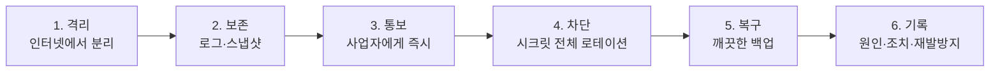

# 보안 정책

## 취약점을 발견하셨다면

**공개 이슈로 올리지 마세요.** 이슈는 누구나 볼 수 있고, 고치기 전에
악용될 수 있습니다.

비공개로 연락 주세요:

- GitHub Security Advisory (저장소 → Security → Report a vulnerability)
- 또는 저장소 관리자에게 직접

확인 후 회신드리고, 수정이 배포된 뒤 공개 여부를 함께 정하겠습니다.

---

## 이 프로젝트가 지키려는 것

우선순위 순입니다.

| 자산 | 잃으면 |
|---|---|
| **문의자 개인정보** (이름·전화·이메일·업체명) | 법적 책임 + 신고 의무. 경쟁사에 영업 리스트 유출 |
| **관리자 계정** | 사이트 변조, 콘텐츠 삭제, 개인정보 열람 |
| 서버 | 채굴·스팸 숙주로 악용, 요금 폭탄 |
| 브랜드 평판 | 변조가 검색결과에 남으면 회복이 오래 걸림 |

---

## 개인정보 유출 시

이름·전화·이메일이 노출됐을 가능성이 있다면 **기술 문제가 아니라 법적
사안**입니다.

- **외부의 불법적 접근에 의한 유출은 건수와 무관하게 신고 대상**이며
  기한은 **72시간**입니다. "몇 명 안 되니 괜찮겠지"는 통하지 않습니다.
- 정보주체 통지 의무가 별도로 있습니다.
- 신고 주체는 사이트를 운영하는 사업자입니다.

발견 즉시 사업자에게 알리고, 기한을 확인하세요.
(정확한 요건은 개인정보보호위원회 안내자료로 확인)

---

## 사고 대응 순서

**지우기 전에 멈추는 것이 먼저입니다.** 성급히 재설치하면 원인을 영영
찾지 못하고, 같은 경로로 다시 뚫립니다.

---

## 저장소를 만질 때 지킬 것

1. **시크릿을 커밋하지 않습니다.** pre-commit 훅이 막지만, 훅은 마지막
   방어선이지 첫 번째가 아닙니다.
2. **`--no-verify` 로 훅을 우회하지 않습니다.** 오탐이면
   `.gitleaks.toml` 의 allowlist 를 **좁게** 고칩니다.
3. **이미 올라간 적이 있는 키는 삭제로 끝나지 않습니다.**
   GitHub 에 올라간 키는 수 분 내에 봇이 수집합니다. **반드시 재발급합니다.**
4. **관리 API 를 추가하면 권한 검증을 같이 추가합니다.**
5. **로그에 비밀번호·토큰·개인정보를 남기지 않습니다.**

배포 전 점검은 [보안 체크리스트](docs/SECURITY-CHECKLIST.md)를 따릅니다.
