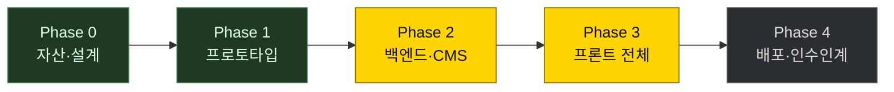
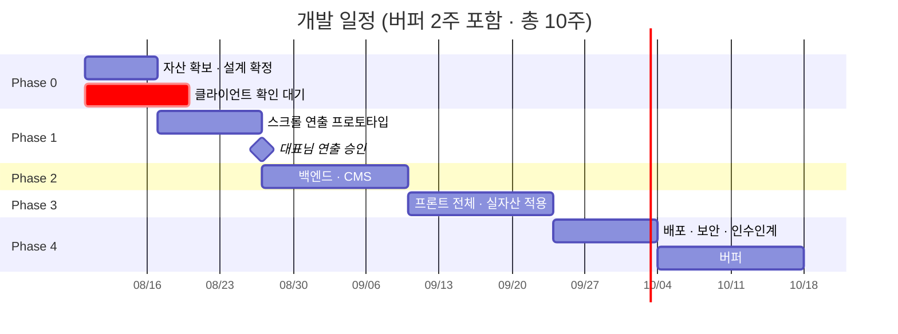

# 작업 계획

| | |
|---|---|
| 프로젝트 | GYMLECO KOREA 공식 웹사이트 |
| 성격 | 실제 상용 사이트 (클라이언트 프로젝트) |
| 목표 행동 | 견적·시연 **문의** — 이커머스가 아니다 |
| 개발 | 정재윤 |

---

## 현재 상태

**기준 2026-09-09 · 대표님 미팅일**

**Phase 2·3 을 함께 진행 중입니다.** 화면과 서버는 섰고, 남은 병목이 바뀌었습니다 —
만드는 일이 아니라 **대표님만 주실 수 있는 자료**입니다.

### 직접 세어 확인한 수치

| 구분 | 항목 | 수 |
|---|---|---|
| 공개 사이트 | 페이지 | 16 |
| | Route Handler | 3 |
| | 화면 부품 | 18 |
| 관리 화면 | 화면 | 17 |
| 서버 | REST API — 관리 45 · 공개 12 | 57 |
| | 컨트롤러 / 엔티티 | 16 / 21 |
| | Java 파일 | 143 |
| | 마이그레이션 `V1`~`V9` / 테이블 | 9 / 22 |
| 기록 | 커밋 — BE 16 · FE 23 · 문서 14 | 53 |

수치는 소스와 실행 중인 서버·DB 에서 직접 센 값입니다. 추정치를 넣지 않았습니다.

---

## 일정

> 기획서 원안은 8주였으나 버퍼가 0이었습니다. Phase 0 을 병목으로 지목해 두고도
> 그 지연을 흡수할 여유가 없어, 대표님께는 **10주**로 안내하는 것을 권장합니다.
> 제품 사진 촬영이 필요해지면 1~2주가 그대로 밀립니다.

---

## 단계별 산출물

### Phase 0 — 자산 확보 & 설계 ✔ 완료

- [x] 저장소 3개 (`FE` · `BE` · `.github`), gitleaks pre-commit 훅
- [x] 아키텍처 결정 (오리진 분리 · 동일 오리진 API · Cloudflare)
- [x] CI — 마이그레이션 실적용 검증, 프리렌더 본문 검사, 시크릿 스캔
- [x] 화면 설계 도면집

### Phase 1 — 프로토타입 ✔ 완료

- [x] 첫 화면 — 기울어진 원판 위 기구 누끼, 끌어서/눌러서 회전
- [x] **실제 기구 사진 5종 적용** (누끼 · 수상 배지 제거)
- [x] 모바일 분기 — 원판 확대, 제품 사진 스와이프
- [x] 다크 · 라이트 테마, 본사 로고 · 파비콘
- [x] 두 줄 헤더 (묶음 3개 · 모바일 서랍 아코디언)

### Phase 2 — 백엔드 · CMS ← 진행 중

**완료**

- [x] 인증 — BCrypt(DB CHECK 강제) · 시도 제한 · JWT HttpOnly 쿠키 · `@PreAuthorize`
- [x] 업로드 — 시그니처 검증 → 재인코딩 → 오브젝트 스토리지, 400/800/1600 렌디션
- [x] 리치 텍스트 저장 시점 살균, 전화번호 AES-256-GCM + 블라인드 인덱스
- [x] 관리 화면 17면 — 제품 · 중고 · 배너 · 구역 배경 · FAQ · 공지 · 문의함 · 설정
- [x] **일련번호 시스템** — 모델번호 · 기구 대장 · 판매 업체 · 사후 관리 이력 · 조회 이력
- [x] **정품 확인** — 공개 `/verify` + 관리자 일련번호 조회

**남은 것**

- [ ] 공식 헬스장 · 소식 API (테이블·엔티티만 있음)
- [ ] 일련번호 CSV 일괄 등록 · QR 라벨 인쇄
- [ ] 제품 갤러리 (DB·엔티티는 있으나 API·화면 없음)
- [ ] 자동화 테스트 — 현재 0건, 검증은 실제 DB·HTTP·브라우저로 수동 수행

### Phase 3 — 프론트 전체 ← 진행 중

- [x] 공개 16면, 모바일 대체 연출, 반응형
- [x] 문의 폼 rate limit + honeypot + 동의 체크박스
- [ ] **제품 상세 사진** — 지금 한 장도 없음
- [ ] 중고 · 공식 헬스장 · 소식 실데이터 (현재 샘플)

**대기 — 대표님만 주실 수 있는 것** ← 지금의 병목

- [ ] **제품 사진** — 기구 6종 × 2~3장. 최소선은 12장
- [ ] **제품 실측 치수와 중량** — 면적으로 설득하는 사이트인데 현재 예시 값
- [ ] 취급 품목의 본사 모델번호 목록
- [ ] 사업자 정보 · 개인정보 보호책임자 · 대표 전화번호
- [ ] 로고 원본(SVG) · 브랜드 가이드
- [ ] 도메인 · 가격 공개 정책
- [ ] 공식 헬스장 게재 동의 명단

### Phase 4 — 배포 · 인수인계 ← 남음
- Cloudflare Tunnel, Access, 보안그룹 최소화
- 보안 헤더 A 등급, 자동 백업 + **복구 테스트 1회**
- 개인정보처리방침 게시, 자동 파기 배치
- **인수인계 문서 + 사용 영상**

---

## 확정된 결정

| # | 결정 | 요지 |
|---|---|---|
| D-2 | 관리자 분리 | 공개/관리자 오리진 분리, 관리자는 API 와 동일 오리진 |
| D-9 | 한글 폰트 | 시스템 스택. `Noto Sans KR` 에 `korean` 서브셋이 없음을 확인 |
| D-11 | Rust 범위 | **이미지 워커만.** 인증·개인정보 경로에는 넣지 않는다 |
| D-12 | 쿠버네티스 | **매니페스트만 산출물로.** 운영은 Docker Compose |
| D-13 | 저장소 분리 | `FE`(web+admin) · `BE` 두 개. 템플릿은 org `.github` 에서 상속 |
| D-14 | BE 내부 분리 | 단일 모듈 + 3겹 분리 (URL 접두사 · 필터체인 · 패키지). 서버를 나누지 않아 비용·운영 부담을 늘리지 않는다 |
| D-15 | 품목 확장 | 기구·부품·악세사리를 `product.type` 으로. 중고는 개별 물건이라 별도 테이블 |
| D-18 | 모델번호 · 일련번호 | **다른 것으로 나눈다.** 모델번호는 `product.model_code`(종류), 일련번호는 `machine_unit`(그 한 대). 둘 다 문자열 — 정수로 잡으면 `Gi-020` 과 앞자리 0 이 깨진다 |
| D-19 | 정품 확인 응답 | 「번호가 있다」 로 끝내지 않고 **그 번호의 기구가 무엇인지** 함께 돌려준다. 존재 여부만 답하면 명판을 베낀 가짜를 우리가 인증해 주는 꼴이 된다 |
| D-20 | 도난 신고 기구 | 공개 화면에서 **「도난」이라 말하지 않는다.** 훔친 사람이 조회해 보고 처분 경로를 바꾼다. 「확인이 필요합니다」 로만 받고 사람이 판단한다 |
| D-21 | 조회 이력 | 성공·실패를 **모두** 남긴다. 같은 번호의 반복 조회가 복제 신호이고, 없는 번호 조회가 몰리는 것은 번호 긁어가기다 |

미결 사항은 [미결 사항](OPEN-DECISIONS.md) 에 있습니다.

---

## 리스크

| 리스크 | 영향 | 지금 상태 |
|---|---|---|
| **제품 사진 없음** | 🔴 제품 상세가 글만 남음 | 첫 화면은 누끼 5종으로 채웠으나 상세는 비어 있음. **최소 12장 필요** |
| **치수가 예시 값** | 🔴 면적으로 설득하는 사이트의 근거가 틀림 | 실측 표 한 장이면 즉시 반영 |
| **자동화 테스트 0건** | 🟠 회귀를 사람이 잡아야 함 | 실제 DB·HTTP·브라우저로 수동 검증 중. enum ↔ DB 제약은 기계 대조로 전환 |
| 사업자 정보 미수령 | 🟠 법적으로 공개 불가 | 없는 전화번호를 적어 두지 않고 그 줄을 감춤 |
| 브랜드 가이드 미수령 | 🟡 색·서체 임시값 | 토큰 한 곳만 바꾸면 됨 |
| 중고·공식헬스장 샘플 | 🟡 「샘플 데이터」 배지가 세 페이지에 | 배지는 유지. 시연 동선에서 뺄지 결정 필요 |
| 관리자 2단계 인증 미구현 | 🟡 `totpCode` 자리만 있음 | 고정 장소 사용 여부에 따라 IP 허용목록으로 대체 가능 |

---

## 보안 우선순위

투자 대비 효과 순 (기획서 §20 + 이번 설계에서 추가된 항목):

1. 시크릿을 git 에 올리지 않기 — **완료**
2. Cloudflare Tunnel 로 인바운드 포트 0개 · SSH 는 SSM — *추가됨*
3. Cloudflare Access 로 관리자 앞 신원 게이트 — *추가됨*
4. 로그인 시도 제한 (IP 기준) + 강한 비밀번호
5. CMS 에디터 XSS 살균
6. 파일 업로드 재인코딩 + 오브젝트 스토리지 서빙
7. 자동 백업 + **복구 테스트**
8. HTTPS · 보안 헤더
9. 개인정보처리방침 · 동의 · 자동 파기
10. TOTP 2FA

이번 설계에서 더해진 것:

11. **일련번호 열거 차단** — IP 당 시간당 60회. 순번을 훑어 유효한 번호
    목록을 만들어 가는 것을 막는다
12. **정품 확인 조회 이력** — 성공·실패 모두 기록. 복제와 긁어가기를 여기서 본다
13. **공개용·관리용 응답 타입 분리** — 하나로 합치면 언젠가 공개 경로로
    업체·연락처가 나간다. 타입을 나누면 컴파일에서 막힌다
14. **평문 전화번호 저장을 DB 가 거부** — `machine_owner` 에 CHECK 제약
