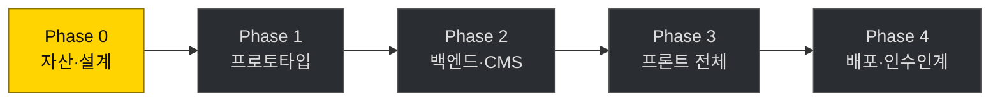

# 작업 계획

| | |
|---|---|
| 프로젝트 | GYMLECO KOREA 공식 웹사이트 |
| 성격 | 실제 상용 사이트 (클라이언트 프로젝트) |
| 목표 행동 | 견적·시연 **문의** — 이커머스가 아니다 |
| 개발 | 정재윤 |

---

## 현재 상태

**Phase 0 진행 중.** 병목은 **제품 사진 자산**입니다 — 확보 상태에 따라 연출 방식과 일정이 결정됩니다.

---

## 일정

> 기획서 원안은 8주였으나 버퍼가 0이었습니다. Phase 0 을 병목으로 지목해 두고도
> 그 지연을 흡수할 여유가 없어, 대표님께는 **10주**로 안내하는 것을 권장합니다.
> 제품 사진 촬영이 필요해지면 1~2주가 그대로 밀립니다.

---

## 단계별 산출물

### Phase 0 — 자산 확보 & 설계 ← 현재

**완료**

- [x] 저장소 3개 생성 (`FE` · `BE` · `.github`), gitleaks pre-commit 훅
- [x] 아키텍처 결정 (오리진 분리 · 동일 오리진 API · Cloudflare)
- [x] DB 스키마 `V1`~`V3` — 실제 PostgreSQL 17 에 적용해 제약 33건 검증
- [x] 공개 페이지 9종 — 메인·제품·상세·중고·부품·악세사리·브랜드·공식헬스장·문의
- [x] 문의 접수 경로 (Route Handler → API, honeypot, 동의 강제)
- [x] 백엔드 도메인·인증·감사 로그 (`.java` 39개)
- [x] 화면 설계 도면집 (클라이언트 확인용)
- [x] CI — 마이그레이션 실적용 검증, 프리렌더 본문 검사, 시크릿 스캔

**대기 — 클라이언트 확인 필요**

- [ ] **제품 사진 자산 점검** ← 병목. 확보 상태에 따라 연출 방식이 결정된다
- [ ] 제품 목록·스펙 (특히 설치 면적) — 현재 전부 자리표시자
- [ ] 브랜드 컬러·로고 벡터
- [ ] 도메인 확정
- [ ] 대표 전화번호 (문의 실패 시 대체 경로로 노출)
- [ ] 사업자 정보 · 개인정보 보호책임자 (푸터·처리방침에 필수)

**남은 구현**

- [ ] 관리자 인증 컨트롤러 · 쿠키 발급
- [ ] 관리 API (제품·소식·문의·설정 CRUD)
- [ ] 이미지 업로드 파이프라인 (시그니처 검증 → 재인코딩 → 스토리지)
- [ ] 관리자 SPA (`FE/admin`)

### Phase 1 — 프로토타입
- 스크롤 연출 실제 자산 적용
- **대표님 확인 → 연출 방향 승인** ★ 말이 아닌 화면으로 합의
- 디자인 시스템 확정

### Phase 2 — 백엔드 · CMS
- 인증: BCrypt · 로그인 시도 제한 · JWT HttpOnly 쿠키 · `@PreAuthorize`
- 업로드: 시그니처 검증 → 재인코딩 → S3/R2
- CMS 에디터 HTML 살균
- 전화번호 암호화 + 블라인드 인덱스, 감사 로그
- CSV 내보내기 (인젝션 방어 + 감사 기록)

### Phase 3 — 프론트 전체
- About / 제품 / 문의 / 소식
- 모바일 대체 연출, 반응형
- 문의 폼 rate limit + honeypot + 동의 체크박스

### Phase 4 — 배포 · 인수인계
- Cloudflare Tunnel, Access, 보안그룹 최소화
- 보안 헤더 A 등급, 자동 백업 + **복구 테스트 1회**
- 개인정보처리방침 게시, 자동 파기 배치
- **인수인계 문서 + 사용 영상**

---

## 확정된 결정

| # | 결정 | 요지 |
|---|---|---|
| D-2 | 관리자 분리 | 공개/관리자 오리진 분리, 관리자는 API 와 동일 오리진 |
| D-9 | 한글 폰트 | 시스템 스택. `Noto Sans KR` 에 `korean` 서브셋이 없음을 확인 |
| D-11 | Rust 범위 | **이미지 워커만.** 인증·개인정보 경로에는 넣지 않는다 |
| D-12 | 쿠버네티스 | **매니페스트만 산출물로.** 운영은 Docker Compose |
| D-13 | 저장소 분리 | `FE`(web+admin) · `BE` 두 개. 템플릿은 org `.github` 에서 상속 |
| D-14 | BE 내부 분리 | 단일 모듈 + 3겹 분리 (URL 접두사 · 필터체인 · 패키지). 서버를 나누지 않아 비용·운영 부담을 늘리지 않는다 |
| D-15 | 품목 확장 | 기구·부품·악세사리를 `product.type` 으로. 중고는 개별 물건이라 별도 테이블 |

미결 사항은 [미결 사항](OPEN-DECISIONS.md) 에 있습니다.

---

## 리스크

| 리스크 | 영향 | 대응 |
|---|---|---|
| **제품 사진 부족** | 🔴 연출 자체가 성립 안 함 | Phase 0 즉시 확인. 임시로 설치 면적 다이어그램으로 대체해 둠 |
| 연출 기대치 차이 | 🟠 후반 재작업 | Phase 1 프로토타입으로 화면 합의 후 진행 |
| 일정 버퍼 부족 | 🟠 오픈일 미준수 | 10주로 안내 |
| 개인정보 유출 | 🔴 법적 책임 | 최소 수집 + 암호화 + 자동 파기 + 책임 소재 사전 합의 |
| 시크릿 유출 | 🔴 사고 원인 1위 | gitleaks 훅 (fail-closed) |
| 유지보수 부담 | 🟠 장기 구속 | 인수인계 산출물 + 범위·기간 사전 합의 |

---

## 보안 우선순위

투자 대비 효과 순 (기획서 §20 + 이번 설계에서 추가된 항목):

1. 시크릿을 git 에 올리지 않기 — **완료**
2. Cloudflare Tunnel 로 인바운드 포트 0개 · SSH 는 SSM — *추가됨*
3. Cloudflare Access 로 관리자 앞 신원 게이트 — *추가됨*
4. 로그인 시도 제한 (IP 기준) + 강한 비밀번호
5. CMS 에디터 XSS 살균
6. 파일 업로드 재인코딩 + 오브젝트 스토리지 서빙
7. 자동 백업 + **복구 테스트**
8. HTTPS · 보안 헤더
9. 개인정보처리방침 · 동의 · 자동 파기
10. TOTP 2FA
