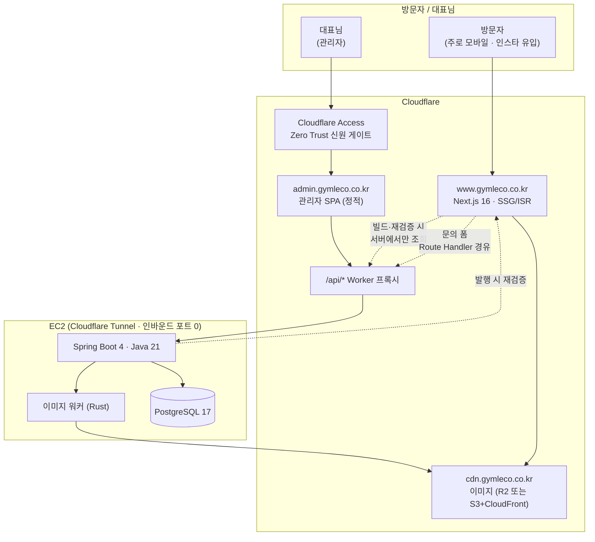
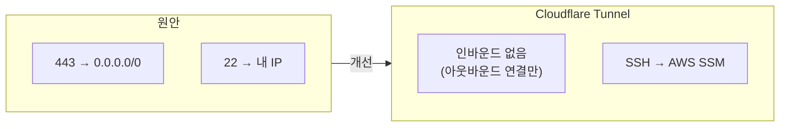
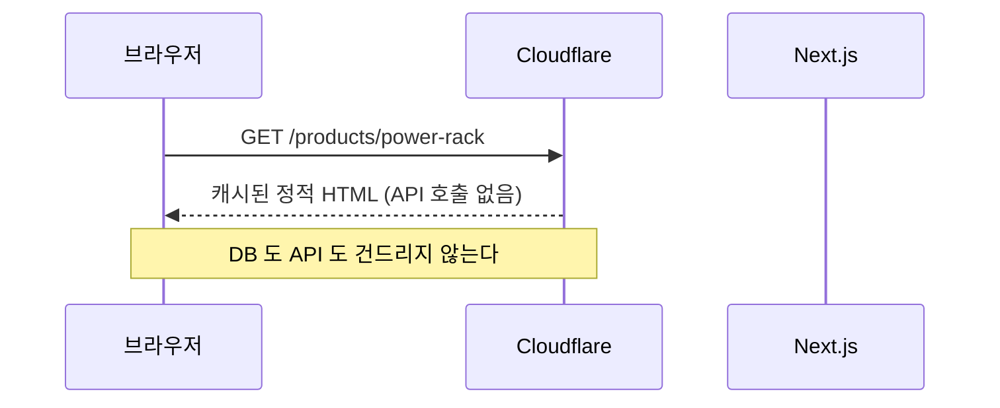
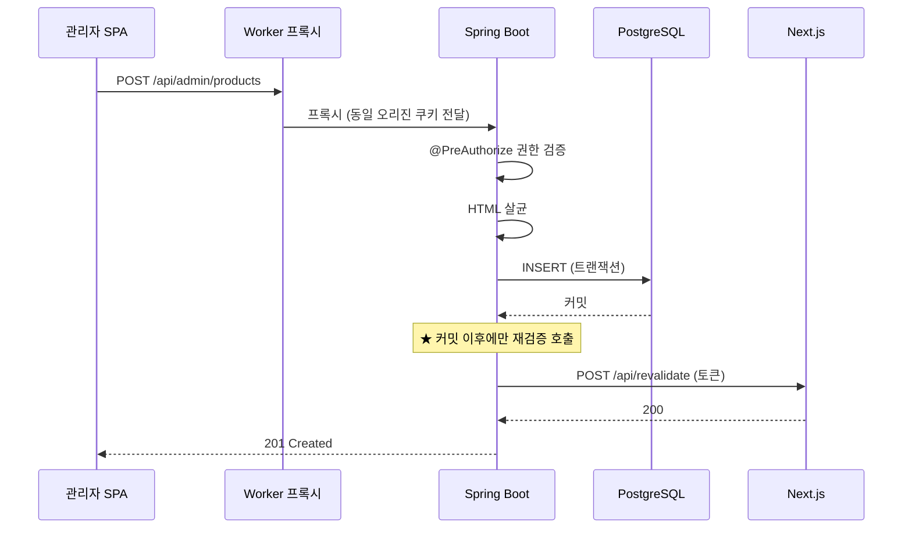

# 인프라 구조

> 최종 확정 전입니다. 결정 근거와 대안은 [미결 사항](OPEN-DECISIONS.md) D-2 / D-10 참고.

---

## 전체 구성

## 핵심 설계 판단

### 1. 오리진은 둘, 서버는 하나

공개 사이트와 관리자는 **다른 도메인**이지만 같은 인프라 위에 있습니다.

- 도메인이 다르므로 → CSP 를 따로 걸 수 있고, 관리자 번들이 공개 사이트에 실리지 않음
- 인프라가 하나이므로 → 청구서 하나, 인수인계 시 "서버 한 대"

### 2. 관리자 SPA 와 API 는 동일 오리진

`admin.gymleco.co.kr/api/*` 를 Worker 가 EC2 로 프록시합니다.

| | 결과 |
|---|---|
| CORS | 필요 없음 |
| 인증 쿠키 | host-only, `SameSite=Strict` 온전히 작동 |
| CSRF | 토큰 방식으로 단순하게 처리 |

### 3. 브라우저는 API 호스트를 직접 부르지 않는다

공개 사이트의 문의 폼도 Next.js Route Handler 를 거칩니다.
API 를 인터넷에 넓게 열 필요가 없어집니다.

### 4. 열린 포트를 0개로

EC2 가 Cloudflare 로 **아웃바운드 연결만** 맺으므로 보안그룹 인바운드를 전부 닫을 수 있습니다.
SSH 도 SSM Session Manager 로 대체하면 열린 포트가 0개가 됩니다.
기획서 §8 의 *"가장 강력한 보안은 문을 없애는 것"* 을 문자 그대로 실현합니다.

### 5. Cloudflare Access

관리자 도메인 앞에 신원 게이트를 둡니다. 50명까지 무료.
**공격자가 로그인 화면에 도달하지 못합니다.** 기획서 §10 이 "최대 표적"이라 지목한
관리자 계정 문제에 대한 가장 값싼 방어입니다.

---

## 요청 경로

### 방문자가 제품 페이지를 볼 때

### 대표님이 제품을 등록할 때

**재검증은 반드시 커밋 이후입니다.** 트랜잭션 안에서 호출하면
롤백됐는데도 사이트가 갱신되거나, 아직 커밋 안 된 데이터를 읽으러 갑니다.
`@TransactionalEventListener(phase = AFTER_COMMIT)` 를 씁니다.

---

## 배포

| 대상 | 방식 |
|---|---|
| 공개 사이트 | GitHub Actions → Cloudflare (Wrangler) |
| 관리자 SPA | GitHub Actions → Cloudflare Pages |
| API | GitHub Actions 에서 이미지 빌드 → GHCR → EC2 에서 pull |
| DB 마이그레이션 | 앱 부팅 시 Flyway 자동 실행 |

**빌드를 EC2 에서 하지 않습니다.** Next.js·Gradle 빌드는 메모리를 많이 써서
작은 인스턴스에서 OOM 이 납니다. CI 에서 빌드하고 산출물만 내려받습니다.

운영은 Docker Compose 로 합니다. 쿠버네티스 매니페스트는
[`k8s/`](https://github.com/gymleco/BE/blob/main/k8s) 에 산출물로 두되 운영에 쓰지 않습니다 —
사이트 하나에 클러스터를 붙이면 비용과 인수인계 부담만 늘어납니다.

---

## 비용 개요 (월, 대략)

| 항목 | 안 B (EC2 단일) |
|---|---|
| EC2 t3.small | ~$15 |
| EBS 30GB | ~$3 |
| Cloudflare | $0 (무료 티어) |
| R2 / S3 | ~$1 |
| 도메인 | ~$2 |
| **합계** | **~$21** |

참고로 EKS 를 쓰면 컨트롤 플레인만 월 $73 이 추가됩니다.
