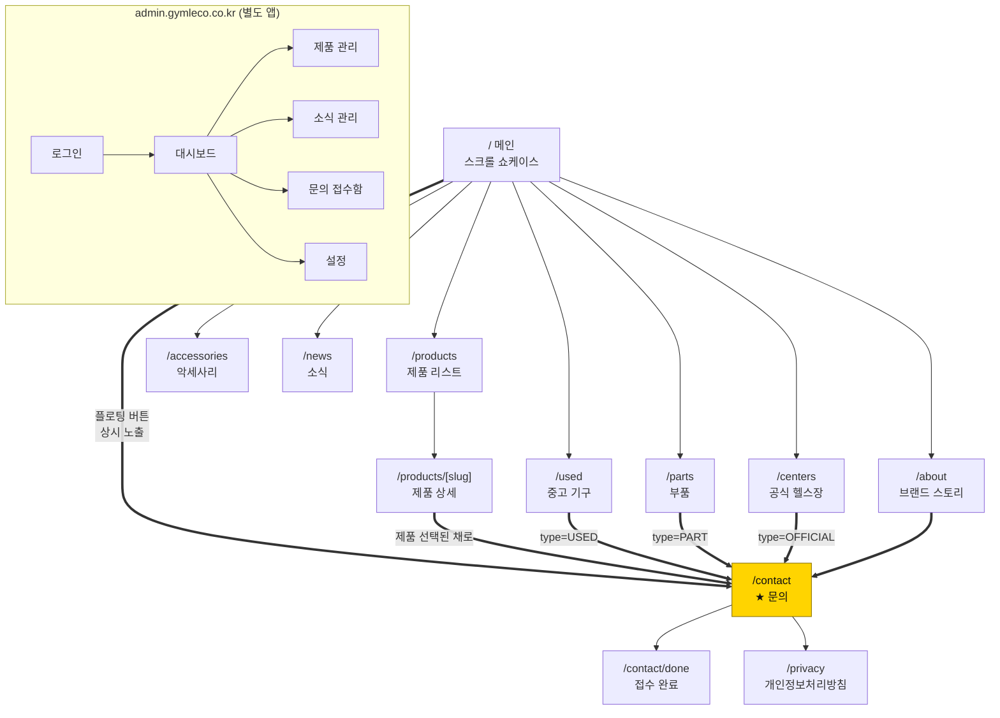
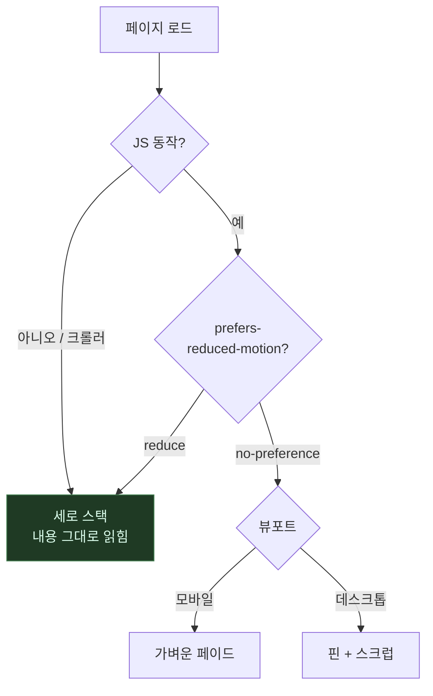
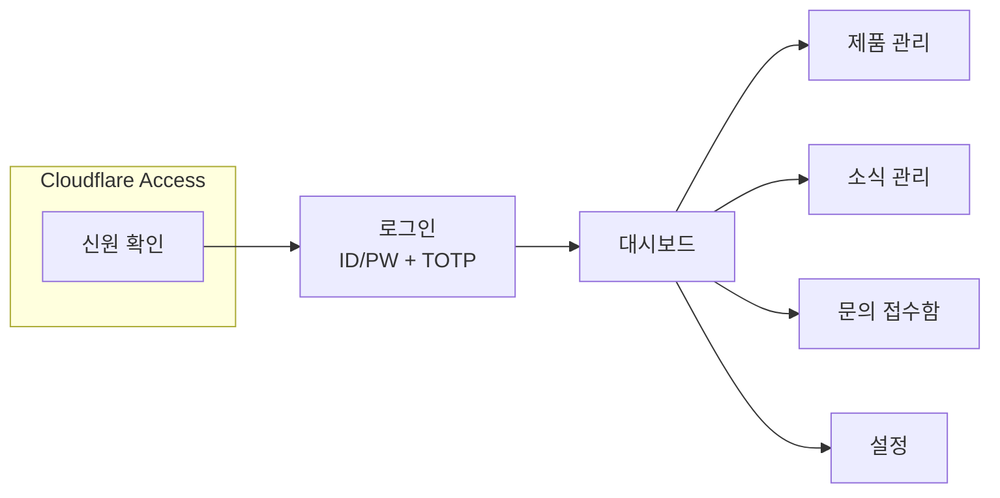

# 화면 설계

Phase 1 연출 승인(기획서 §15)과 Phase 3 구현의 기준 문서입니다.
와이어프레임은 **배치와 정보 위계**를 정하기 위한 것이고, 색·타이포는
브랜드 가이드 수령 후 확정합니다.

---

## 사이트맵



**모든 경로가 문의로 수렴합니다.** 문의가 아닌 종착지는 없습니다.

---

## 공통 요소

### 헤더

```
데스크톱
┌────────────────────────────────────────────────────┐
│ GYMLECO              제품   브랜드   소식   문의   │
└────────────────────────────────────────────────────┘

모바일
┌────────────────────────────────────────────────────┐
│ GYMLECO                                       ☰    │
└────────────────────────────────────────────────────┘
```

메인 상단에서는 배경 위에 겹쳐 두고, 스크롤하면 배경이 생깁니다.
**햄버거 메뉴 안에도 문의 버튼을 둡니다.**

### 플로팅 문의 버튼

```
                                    ┌──────────────┐
                                    │ 견적·무료시연│  ← 우하단 고정
                                    └──────────────┘     z-40
```

스크롤 위치와 무관하게 **항상 보입니다**(기획서 §3.4-4).
`/contact` 페이지에서만 숨깁니다 — 이미 그 화면에 있으므로.

### 푸터

```
┌────────────────────────────────────────────────────┐
│ GYMLECO              브랜드 소개    견적 문의      │
│ 스웨덴 본사 직영.    제품          무료 시연 신청 │
│ 공간을 아는 기구.    소식          개인정보처리방침│
│ ─────────────────────────────────────────────────  │
│ 짐레코 코리아 · 대표자 — · 사업자등록번호 —       │
│ 주소 — · 전화 — · 이메일 —                        │
└────────────────────────────────────────────────────┘
```

⚠️ 사업자 정보는 대표님께 받아 채웁니다. **개인정보처리방침 링크는
문의 폼을 여는 시점에 반드시 살아 있어야 합니다.**

---

## `/` 메인 — 스크롤 쇼케이스 ★ 핵심

```
스크롤       구간                          상시 노출
─────────────────────────────────────────────────────
  0%   ┌──────────────────────────────┐   ┌─────────┐
       │ GYMLECO          제품 브랜드 │   │ 견적·   │
       │                              │   │ 무료시연│
       │ BORN IN SWEDEN               │   │ 문의    │
       │ 스웨덴에서 온,               │   └─────────┘
       │ 공간을 아는 기구             │    ↑ 우하단
       │                              │      고정
       │ 본사 직영이라 중간 마진이    │
       │ 없습니다. 20~30평에도…       │
       │                              │
       │ [무료 시연 신청] [라인업 →]  │
       │                              │
       │ SCROLL                       │
       └──────────────────────────────┘
 10%   ┌──────────────────────────────┐
       │ "좋은 기구는 조용합니다.     │
       │  흔들리지 않고, 자주 고장    │
       │  나지 않고, 필요 이상으로    │
       │  자리를 차지하지 않습니다."  │
       │                              │
       │  1985년부터 스웨덴에서…      │
       └──────────────────────────────┘
 20%   ┌──────────────────────────────┐  ★ 핀 고정
   ~   │                    01 / 06   │
 70%   │  ┌────────┐  RACK            │
       │  │        │  파워 랙         │
       │  │ 설치   │  POWER RACK      │
       │  │ 면적   │                  │
       │  │ 다이어 │  프리웨이트의    │
       │  │ 그램   │  중심.           │
       │  │        │                  │
       │  │ ▨ 2.6  │  설치면적 2.6 m² │
       │  │ ░ 4.2  │  1400×1850×2300  │
       │  └────────┘  210 kg          │
       │   −38%       [자세히 보기 →] │
       │                              │
       │  스크롤 = 타임라인 (역재생)  │
       └──────────────────────────────┘
 70%   ┌──────────────────────────────┐
       │ 왜 짐레코인가                │
       │ ┌────────┬────────┬────────┐ │
       │ │ 본사   │ 공간   │ 오피셜 │ │
       │ │ 직영   │ 효율   │ 센터   │ │
       │ └────────┴────────┴────────┘ │
       │ 기구를 직접 써보고 결정하시는│
       │ 편이 빠릅니다. [무료 시연 →] │
       └──────────────────────────────┘
 80%   ┌ 소식 3건 ────────────────────┐
 90%   ┌──────────────────────────────┐
       │ "공간을 알려주시면           │
       │  배치안을 함께 그려 드립니다"│
       │ [견적 문의] [무료 시연 신청] │
       └──────────────────────────────┘
100%   ┌ 푸터 ────────────────────────┐
```

### 반응형 분기

| | 데스크톱 (≥768px) | 모바일 (<768px) |
|---|---|---|
| 제품 시퀀스 | 핀 고정 + 스크럽. 패널이 겹쳐 전환 | 세로 스택. 화면 밖 카드만 페이드인 |
| 레이아웃 | 2열 (다이어그램 ↔ 텍스트) | 1열 |
| 진행 표시 | `01 / 06` 카운터 | 없음 |

**모바일이 주 트래픽일 가능성이 높습니다**(인스타 유입). 스크럽은 중급
안드로이드에서 버벅이므로 분기가 선택이 아니라 필수입니다.

### 연출이 꺼지는 경우



어느 경로로 빠지든 **최악의 결과가 "애니메이션 없는 목록"이지 "빈 화면"이
아니어야** 합니다. 이 페이지의 1순위 제약입니다.

---

## `/products` — 제품 리스트

```
┌────────────────────────────────────────────────────┐
│ 제품 라인업                                        │
│ 20~30평 공간에도 라인업을 온전히 갖출 수 있습니다  │
│                                                    │
│ [전체] [머신] [케이블] [랙] [벤치] [유산소]        │
│                                                    │
│ ┌──────────┐ ┌──────────┐ ┌──────────┐            │
│ │  이미지  │ │  이미지  │ │  이미지  │            │
│ │          │ │          │ │          │            │
│ ├──────────┤ ├──────────┤ ├──────────┤            │
│ │ RACK     │ │ CABLE    │ │ STRENGTH │            │
│ │ 파워 랙  │ │ 케이블…  │ │ 스미스…  │            │
│ │ 2.6 m²   │ │ 3.1 m²   │ │ 2.4 m²   │            │
│ └──────────┘ └──────────┘ └──────────┘            │
│ ┌──────────┐ ┌──────────┐ ┌──────────┐            │
│ │   …      │ │   …      │ │   …      │            │
│ └──────────┘ └──────────┘ └──────────┘            │
│                                                    │
│ 원하는 구성이 없으신가요? [문의하기 →]             │
└────────────────────────────────────────────────────┘
```

- 카드에 **설치 면적을 항상 노출**합니다. 핵심 소구점입니다.
- 필터는 URL 쿼리(`?category=RACK`)로 유지해 **공유·뒤로가기가 동작**하게 합니다.
- 그리드: 데스크톱 3열 / 태블릿 2열 / 모바일 1열
- 가격은 표시하지 않습니다 (§18-8 확정 전까지 견적 문의 유도)

**빈 상태** — 필터 결과가 없으면 "해당 카테고리 제품이 준비 중입니다"
+ 전체 보기 링크. 막다른 길을 만들지 않습니다.

---

## `/products/[slug]` — 제품 상세

```
┌────────────────────────────────────────────────────┐
│ 제품 > 랙 > 파워 랙                                │
│                                                    │
│ ┌────────────────────┐  RACK                       │
│ │                    │  파워 랙                    │
│ │     대표 이미지    │  POWER RACK                 │
│ │                    │                             │
│ │                    │  프리웨이트의 중심.         │
│ └────────────────────┘  한 대로 스쿼트부터 풀업까지│
│ ┌──┐┌──┐┌──┐┌──┐        ─────────────────────────  │
│ └──┘└──┘└──┘└──┘        설치 면적    2.6 m²        │
│  갤러리 썸네일          가로×세로×높이            │
│                         1400×1850×2300 mm         │
│                         중량          210 kg      │
│                                                    │
│                         [이 제품 견적 문의 →]      │
│                         [무료 시연 신청]           │
│                                                    │
│ ── 설치 공간 ──────────────────────────────────────│
│ ┌─────────────────┐                                │
│ │  ▨ 짐레코 2.6m² │  일반 기구 대비 38% 절약       │
│ │  ░ 평균  4.2m²  │                                │
│ └─────────────────┘                                │
│                                                    │
│ ── 상세 설명 ──────────────────────────────────────│
│ (CMS 리치 텍스트 — 서버에서 살균된 HTML)           │
│                                                    │
│ ── 함께 보는 제품 ─────────────────────────────────│
│ ┌──────┐ ┌──────┐ ┌──────┐                        │
│ └──────┘ └──────┘ └──────┘                        │
└────────────────────────────────────────────────────┘
```

- **문의 버튼에 제품이 미리 선택**돼 넘어갑니다 (`/contact?product=power-rack`).
  방문자가 다시 고르게 하지 않습니다.
- 설치 공간 다이어그램은 메인 쇼케이스와 같은 컴포넌트를 재사용합니다.
- 상세 설명은 CMS 입력이므로 **반드시 서버에서 살균된 값만** 렌더합니다.

---

## `/about` — 브랜드

```
┌────────────────────────────────────────────────────┐
│ BORN IN SWEDEN                                     │
│ 1985년, 스웨덴에서 시작했습니다                    │
│                                                    │
│ (본사 전경 / 제조 현장 이미지)                     │
│                                                    │
│ ── 제조 철학 ──────────────────────────────────────│
│ 화려한 디스플레이 대신 프레임의 두께와 용접,       │
│ 베어링의 수명에 비용을 씁니다.                     │
│                                                    │
│ ┌──────────┬──────────┬──────────┐                │
│ │ 내구성   │ 공간효율 │ 운동감   │                │
│ └──────────┴──────────┴──────────┘                │
│                                                    │
│ ── 한국 총판 ──────────────────────────────────────│
│ 본사 직영 총판이라 중간 마진이 없고               │
│ 부품 조달 경로가 짧습니다.                         │
│                                                    │
│ ── 오피셜 센터 제도 ───────────────────────────────│
│ 조건 · 혜택 · 신청 방법                            │
│ [오피셜 센터 문의 →]                               │
│                                                    │
│ ── 도입 센터 ──────────────────────────────────────│
│ (게재 동의 확인 후 노출 — §18-5)                   │
└────────────────────────────────────────────────────┘
```

> 해외 리뷰에서 짐레코는 "디지털 통합 기능이 제한적"이라는 평도 있습니다.
> 이 페이지는 **디지털 기능이 아니라 내구성·공간효율·운동감**으로
> 프레임을 잡습니다 (기획서 §1.3).

---

## `/used` — 중고 기구

```
┌────────────────────────────────────────────────────┐
│ 중고 기구                       현재 판매중 3 건   │
│ 센터 리뉴얼·폐업으로 회수한 기구를 점검 후 판매    │
│ ── 상태 등급 기준 ─────────────────────────────────│
│ ┌─────────┬─────────┬─────────┐                   │
│ │ Ⓐ 상급  │ Ⓑ 중급  │ Ⓒ 하급  │                   │
│ │사용감 거의│생활 스크│외관 손상│                   │
│ │ 없음     │래치     │ 있음    │                   │
│ └─────────┴─────────┴─────────┘                   │
│                                                    │
│ ┌──────────┐ ┌──────────┐ ┌──────────┐            │
│ │ [판매중] │ │ [판매중] │ │ [예약중] │            │
│ │ A급      │ │ B급      │ │ B급      │            │
│ │ 파워 랙  │ │ 랫 풀다운│ │ 스미스…  │            │
│ │ 2021년식 │ │2019·2대  │ │ 2018년식 │            │
│ │ 가격 문의│ │ 가격 문의│ │ 가격 문의│            │
│ │ 문의하기→│ │ 문의하기→│ │          │            │
│ └──────────┘ └──────────┘ └──────────┘            │
│ ┌──────────┐  ← 판매완료는 흐리게, 목록에는 남김   │
│ │ [판매완료]│                                      │
│ └──────────┘                                       │
│                                                    │
│ 재고는 수시로 바뀝니다 [입고 알림 신청]            │
│ 기구를 처분하셔야 한다면 — 매입 상담도 진행        │
└────────────────────────────────────────────────────┘
```

**중고는 "상태를 믿을 수 있는가"가 구매 결정의 전부입니다.** 그래서
상품 목록보다 **등급 기준을 먼저** 보여줍니다. 등급의 의미를 모른 채
"A급"만 보면 판단할 수 없습니다.

**판매완료 매물을 지우지 않습니다.** 흐리게 남겨두면 "물건이 도는 곳"으로
읽힙니다. 목록이 비어 보이면 다시 오지 않습니다.

가격은 대부분 협의라 **"가격 문의"** 가 기본입니다. 빈칸으로 두면
"준비 중"으로 오해받습니다.

---

## `/parts` — 부품

```
┌────────────────────────────────────────────────────┐
│ 부품                                               │
│ 본사 직영이라 부품 조달 경로가 짧습니다            │
│ ┌────────┐ ┌────────┐ ┌────────┐                  │
│ │케이블  │ │도르래  │ │벤치 패드│                 │
│ │와이어  │ │휠      │ │        │                  │
│ └────────┘ └────────┘ └────────┘                  │
│                                                    │
│ ── 어떤 부품이 필요한지 모르시겠다면 ─────────────│
│ 1 증상을 알려주세요                                │
│   "케이블에서 소음이 난다" 정도면 충분             │
│ 2 사진 한 장이면 더 빠릅니다                       │
│ 3 교체 주기도 안내드립니다                         │
│                                                    │
│ [부품 문의하기]  타사 기구는 호환 확인 필요        │
└────────────────────────────────────────────────────┘
```

**부품은 "무엇이 필요한지 모르는" 상태로 오는 방문자가 많습니다.**
목록만 두면 이탈합니다. 증상으로 문의할 수 있는 경로를 함께 둡니다.

---

## `/accessories` — 악세사리

제품 카드 그리드 + "기구와 함께 주문하면 배송·설치를 한 번에" 안내.

**고무 바닥재는 기구를 들이기 전에 깔아야 합니다.** 오픈 일정이 정해져
있으면 기구 견적 단계에서 함께 논의해야 하므로 그 사실을 명시합니다.
(아래층 소음 민원의 대부분이 이 단계에서 해결됩니다.)

---

## `/centers` — 짐레코 공식 헬스장

```
┌────────────────────────────────────────────────────┐
│ 짐레코 공식 헬스장                                 │
│ 카탈로그 사진보다 직접 잡아보는 편이 빠릅니다      │
│                                                    │
│ ─ 서울 ───────────────────────────────────────────│
│ ┌──────────┐ ┌──────────┐                         │
│ │ 사진     │ │ 사진     │                         │
│ │ ○○피트니스│ │ □□스튜디오│                        │
│ │ 강남구 — │ │ 해운대 — │                         │
│ │ 40평·2024│ │ 32평·2025│                         │
│ │ 도입 기구:│ │ 도입 기구:│                        │
│ │ (파워랙) │ │ (레그프레스)                       │
│ └──────────┘ └──────────┘                         │
│ ─ 경기 ───────────────────────────────────────────│
│                                                    │
│ ── 오피셜 센터 제도 ──────────────────────────────│
│ 공식 사이트 노출 / 시연 거점 / 운영 지원           │
│ [오피셜 센터 신청 · 문의]                          │
└────────────────────────────────────────────────────┘
```

- **지역별로 묶습니다.** 방문자는 "가까운 곳"을 찾지 전국 목록을 보지 않습니다
- 도입 기구를 칩으로 걸어 **제품 상세로 되돌아가는 경로**를 만듭니다
- 센터 정보는 **게재 동의를 받은 곳만** 노출합니다 (DB CHECK 로 강제)
- 목록이 비어 있으면 "시연을 원하시면 직접 방문 일정을 잡아 드립니다" 로 대체

---

## `/news`, `/news/[slug]` — 소식

```
목록                              상세
┌──────────────────────────┐     ┌──────────────────────────┐
│ 짐레코 소식              │     │ 소식 > 제목              │
│                          │     │                          │
│ ┌────┬───────────────┐   │     │ 2026.08.10               │
│ │ 썸 │ 제목          │   │     │ 신제품 입고 안내         │
│ │ 네일│ 요약 …        │   │     │ ┌──────────────────┐    │
│ │    │ 2026.08.10    │   │     │ │   대표 이미지    │    │
│ └────┴───────────────┘   │     │ └──────────────────┘    │
│ ┌────┬───────────────┐   │     │ 본문 (살균된 HTML)      │
│ └────┴───────────────┘   │     │ …                        │
│                          │     │                          │
│ [더 보기]                │     │ [목록으로] [문의하기 →]  │
└──────────────────────────┘     └──────────────────────────┘
```

**빈 상태** — "등록된 소식이 아직 없습니다." 오픈 초기에는 비어 있는 것이
정상이므로 어색하지 않게 문구를 둡니다.

---

## `/contact` — 문의 ★ 가장 중요한 화면

```
┌───────────────────────────────────────────┐
│ 공간을 알려주시면 배치안을 함께 그려      │
│ 드립니다                                  │
│                                           │
│ 문의 유형  (●견적) (○무료시연) (○오피셜)  │
│                                           │
│ 이름 *      [___________________]         │
│ 연락처 *    [___________________]         │
│ 이메일      [___________________]         │
│ 업체명      [___________________]         │
│ 지역        [▼ 선택            ]          │
│ 평수·천장고 [___________________]         │
│ 관심 제품   ☐파워랙 ☐케이블 ☐스미스…      │
│ 내용        [                   ]         │
│             [                   ]         │
│                                           │
│ ┌───── 개인정보 수집·이용 동의 ─────────┐ │
│ │ ☐ (필수) 수집·이용에 동의합니다      │ │
│ │    항목: 이름, 연락처, 이메일, 업체명 │ │
│ │    목적: 문의 응대 및 견적 안내       │ │
│ │    보유: 처리 완료 후 1년             │ │
│ │    → 처리방침 자세히 보기             │ │
│ │ ☐ (선택) 마케팅 정보 수신 동의       │ │
│ └───────────────────────────────────────┘ │
│                                           │
│ [ 문의 보내기 ]                           │
│                                           │
│ (숨김) honeypot — 봇만 채운다             │
└───────────────────────────────────────────┘
```

**설계 규칙**

- 필수는 **이름·연락처·동의** 뿐. 최소 수집 원칙(§14)
- 동의 체크박스는 **기본 해제**. 미리 체크해 두면 동의로 인정되지 않습니다
- **마케팅 동의는 반드시 별도 항목.** 필수 동의에 묶으면 위법
- honeypot 은 UX 를 해치지 않는 봇 차단. reCAPTCHA 는 전환율 고려해 2차
- 제품 상세에서 넘어오면 **관심 제품이 미리 체크**돼 있습니다

### 상태

| 상태 | 화면 |
|---|---|
| 입력 오류 | 해당 필드 아래 빨간 문구. 첫 오류 필드로 포커스 이동 |
| 전송 중 | 버튼 비활성 + "보내는 중…". **중복 제출 차단** |
| 성공 | `/contact/done` 으로 이동 |
| rate limit | "잠시 후 다시 시도해 주세요" (봇 여부를 알리지 않음) |
| 서버 오류 | "전송에 실패했습니다. 전화로 문의해 주세요: —" **대체 경로 제시** |

### 접수 흐름


메일 발송이 실패해도 **문의는 이미 저장돼 있어야 합니다.**

### `/contact/done` — 접수 완료

```
┌───────────────────────────────────────────┐
│              ✓                            │
│      문의가 접수되었습니다                │
│                                           │
│  담당자가 영업일 기준 1일 이내에          │
│  연락드리겠습니다.                        │
│                                           │
│  급하시면 — 전화 —                        │
│                                           │
│  [제품 더 보기]  [홈으로]                 │
└───────────────────────────────────────────┘
```

**언제 연락이 오는지 명시합니다.** 기다림이 불안하면 이탈합니다.

---

## `/privacy` — 개인정보처리방침

법적 필수 페이지입니다. 다음을 반드시 포함합니다(§14):

수집 항목 · 수집 목적 · 보유 기간 · 파기 절차 · 제3자 제공 여부 ·
처리 위탁 · 정보주체 권리 · **개인정보 보호책임자** · 시행일

> 초안은 작성해 드릴 수 있으나 **법적 책임 주체는 사업자(짐레코 코리아)** 입니다.
> 계약 시 명확히 해두는 것이 서로에게 안전합니다.

---

## 관리자 화면



### 로그인

```
┌─────────────────────────────┐
│         GYMLECO             │
│         관리자              │
│                             │
│  아이디  [_______________]  │
│  비밀번호[_______________]  │
│  인증번호[______]  (2FA)    │
│                             │
│  [ 로그인 ]                 │
│                             │
│  5회 실패 시 15분간         │
│  로그인이 제한됩니다        │
└─────────────────────────────┘
```

**실패 메시지를 구분하지 않습니다.** "없는 아이디"와 "비밀번호 틀림"을
나누면 계정 존재 여부가 새어 나갑니다. 둘 다 같은 문구.

### 대시보드

```
┌────────────────────────────────────────────────────┐
│ GYMLECO 관리자                       홍길동 ▾      │
├──────────┬─────────────────────────────────────────┤
│ 대시보드 │  ┌──────────┐ ┌──────────┐              │
│ 제품     │  │ 신규 문의│ │ 이번 달  │              │
│ 소식     │  │    3     │ │   12     │              │
│ 문의     │  └──────────┘ └──────────┘              │
│ 설정     │                                         │
│          │  최근 문의                              │
│          │  ┌────────────────────────────────┐    │
│          │  │ 김** · 무료시연 · 08-10   [보기]│    │
│          │  │ 이** · 견적    · 08-09   [보기]│    │
│          │  └────────────────────────────────┘    │
└──────────┴─────────────────────────────────────────┘
```

**대시보드 첫 화면에 신규 문의 건수를 둡니다.** 대표님이 가장 자주 볼
정보이고, 이 사이트의 존재 이유이기 때문입니다.

### 제품 관리

```
목록                                편집
┌──────────────────────────┐       ┌──────────────────────────────┐
│ 제품  [+ 새 제품 등록]   │       │ 제품 편집                    │
│ ┌──┬─────────┬────┬───┐  │       │                              │
│ │≡ │ 파워 랙 │2.6 │ ● │  │       │ ── 기본 정보 (필수) ──       │
│ │≡ │ 케이블…│3.1 │ ● │  │       │ 이름(한글)* [__________]     │
│ │≡ │ 스미스…│2.4 │ ○ │  │       │ 이름(영문)* [__________]     │
│ └──┴─────────┴────┴───┘  │       │ 카테고리*   [▼        ]     │
│  ↑드래그로 순서 변경     │       │ 한 줄 소개* [__________]     │
│  ● 공개  ○ 비공개        │       │                              │
└──────────────────────────┘       │ ── 크기 (필수) ──            │
                                   │ 설치 면적*  [___] m²         │
                                   │ 가로/세로/높이 [_][_][_] mm  │
                                   │ 중량*       [___] kg         │
                                   │                              │
                                   │ ── 이미지 ──                 │
                                   │ 대표 이미지 [ 파일 선택 ]    │
                                   │ 권장 1600×1200 이상, 10MB 이하│
                                   │ ┌──┐┌──┐┌──┐ [+ 추가]       │
                                   │                              │
                                   │ ── 상세 설명 ──              │
                                   │ [에디터]                     │
                                   │                              │
                                   │ 사이트에 공개  ○ 켜기 ● 끄기 │
                                   │                              │
                                   │ [미리보기] [저장]            │
                                   └──────────────────────────────┘
```

**비개발자 기준으로 만듭니다**(§4.1) — CMS 를 직접 만드는 유일한 이유입니다.

- "슬러그", "메타데이터" 같은 말을 화면에 쓰지 않습니다
- **필수/선택을 명확히 구분**합니다
- 이미지 업로드에 권장 해상도를 안내합니다
- 삭제·비공개 전환에는 확인창을 둡니다
- **저장 전 미리보기**를 제공합니다
- 저장하면 공개 사이트가 자동 갱신됩니다 (ISR 재검증)

### 문의 접수함 ★ 개인정보

```
목록                                            상세
┌──────────────────────────────────────────┐   ┌────────────────────────────┐
│ 상태[전체▼] 검색[______] [CSV 내보내기]  │   │ 문의 상세          [닫기]  │
├────┬──────┬────────┬──────────┬──────────┤   │                            │
│상태│ 이름 │ 유형   │ 업체     │ 접수일   │   │ 이름     홍길동            │
├────┼──────┼────────┼──────────┼──────────┤   │ 연락처   010-1234-5678     │
│신규│ 김** │무료시연│○○피트니스│ 08-10    │   │ 이메일   hong@example.com  │
│연락│ 이** │ 견적   │△△짐     │ 08-09    │   │ 업체명   ○○피트니스       │
│완료│ 박** │ 견적   │□□스튜디오│ 08-07    │   │ 지역     서울              │
└────┴──────┴────────┴──────────┴──────────┘   │ 관심제품 파워랙, 케이블…  │
                                                │ 내용     20평 규모 창업…  │
                                                │                            │
                                                │ 상태  [▼ 연락중        ]  │
                                                │ 메모  [________________]  │
                                                │                            │
                                                │ 접수 2026-08-10 14:03      │
                                                │ 파기 예정 2027-08-10       │
                                                └────────────────────────────┘
```

| 화면 | 개인정보 취급 |
|---|---|
| 목록 | **이름 마스킹**(`김**`), 전화번호 미표시 |
| 상세 | 복호화해 표시. **조회 사실을 감사 로그에 기록** |
| 검색 | 블라인드 인덱스로 조회. 복호화하지 않음 |
| CSV | `ADMIN` 만. **감사 로그 필수** |

**목록에서 이름을 마스킹하는 이유** — 화면을 켜 둔 것만으로 개인정보가
노출되지 않게 하기 위해서입니다. 사무실에서 모니터는 생각보다 많이 보입니다.

**파기 예정일을 화면에 표시**합니다. 보유기간이 추상적인 규칙이 아니라
눈에 보이는 값이 됩니다.

### 설정

```
┌────────────────────────────────────────────┐
│ 설정                                       │
│                                            │
│ ── 연락처 ──                               │
│ 전화 [_______] 이메일 [_______]            │
│ 주소 [___________________________]         │
│                                            │
│ ── 사업자 정보 (푸터 표시) ──              │
│ 상호 [_______] 대표자 [_______]            │
│ 사업자등록번호 [_______________]           │
│                                            │
│ ── SNS ──                                  │
│ 인스타그램 [___________] 유튜브 [________] │
│                                            │
│ ── 메인 화면 ──                            │
│ 쇼케이스에 노출할 제품 (순서대로)          │
│ ┌──────────────────┐                       │
│ │ ≡ 파워 랙        │  ↑드래그로 순서 변경  │
│ │ ≡ 케이블 크로스… │                       │
│ └──────────────────┘                       │
│ 상단 배너 문구 [___________________]       │
│                                            │
│ [저장]                                     │
└────────────────────────────────────────────┘
```

---

## 반응형 기준

| 구간 | 폭 | 비고 |
|---|---|---|
| 모바일 | < 768px | **주 트래픽 가정** (인스타 유입) |
| 태블릿 | 768–1023px | 2열 그리드 |
| 데스크톱 | ≥ 1024px | 3열 그리드, 스크롤 연출 활성 |

`768px` 이 연출 분기점과 같습니다. 관리자 화면은 **태블릿 이상**을 기준으로
합니다 — 대표님이 폰으로 제품을 등록하실 일은 없지만, 문의 확인은 폰에서
하실 수 있으므로 **문의 목록·상세만 모바일 대응**합니다.

---

## 전 화면 공통 상태

새 화면을 만들 때 이 네 가지를 항상 정의합니다. 하나라도 빠지면
사용자가 막다른 길에 놓입니다.

| 상태 | 규칙 |
|---|---|
| **로딩** | 스피너보다 스켈레톤. 레이아웃이 흔들리지 않게 |
| **빈 상태** | 왜 비었는지 + 다음 행동 제시. "없음"만 두지 않는다 |
| **오류** | 무엇이 잘못됐는지 + **대체 경로**(전화번호 등) |
| **권한 없음** | 관리자 화면에서 401 이면 로그인으로. 흰 화면 금지 |

---

## 접근성 (전 화면)

- 모든 이미지에 `alt`. 장식용은 `alt=""`
- 키보드만으로 문의 폼 전 과정이 가능해야 함
- 포커스 표시를 지우지 않음 (`:focus-visible` 유지)
- 본문 대비 4.5:1 이상
- **"본문 바로가기"** 링크로 긴 연출을 건너뛸 수 있게
- 색만으로 정보를 전달하지 않음 (공개/비공개는 아이콘+텍스트 병기)
