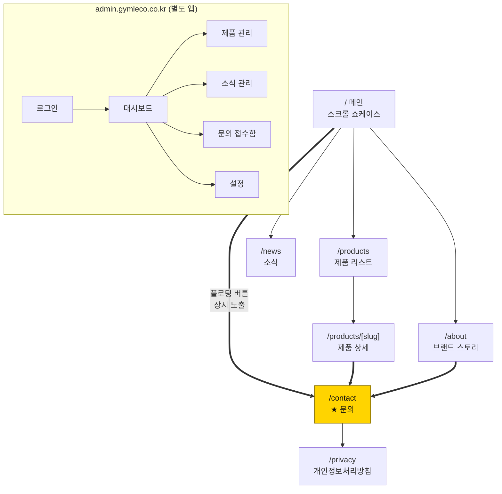
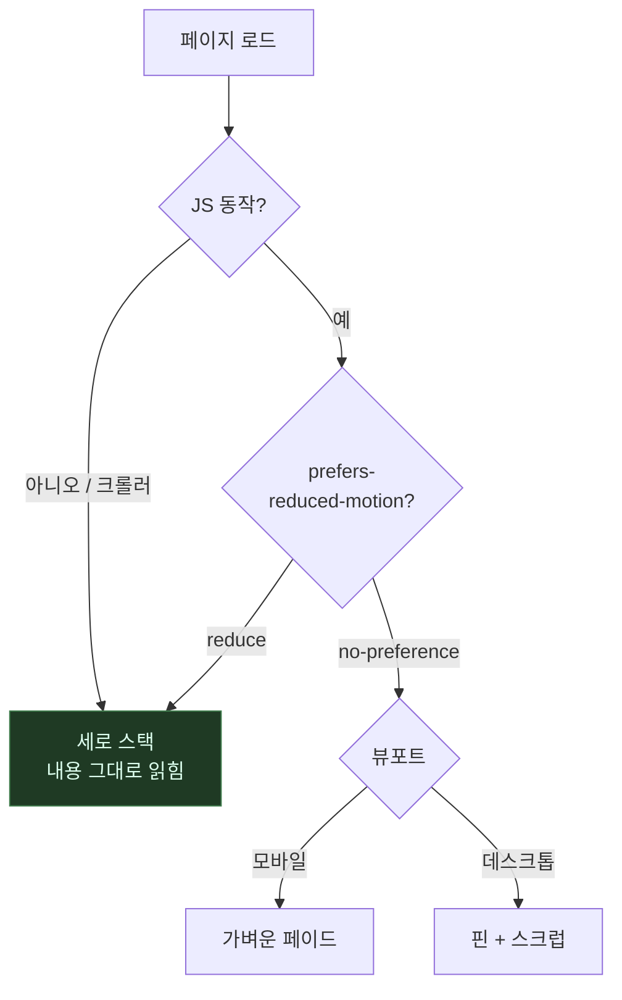
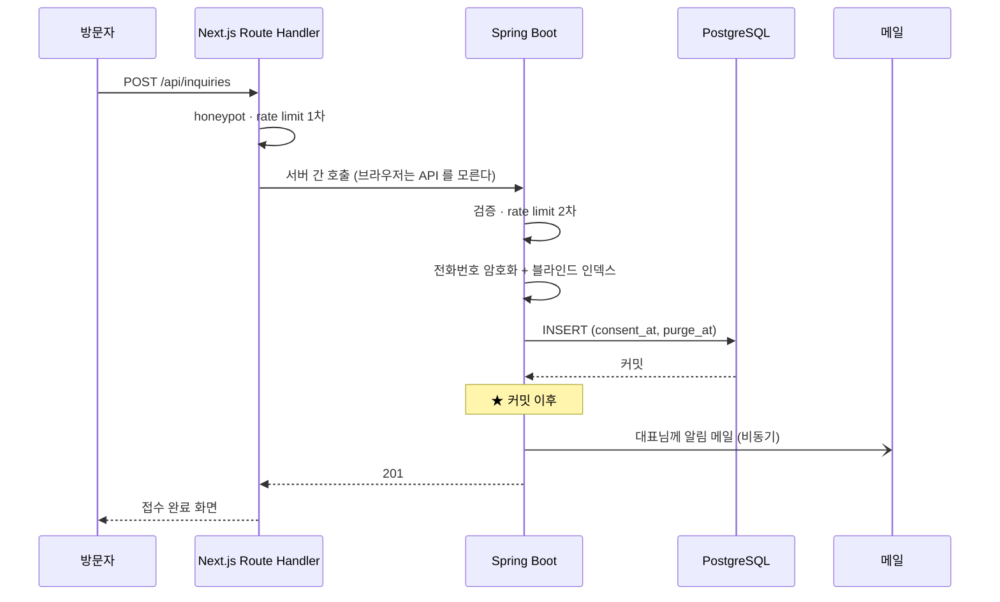
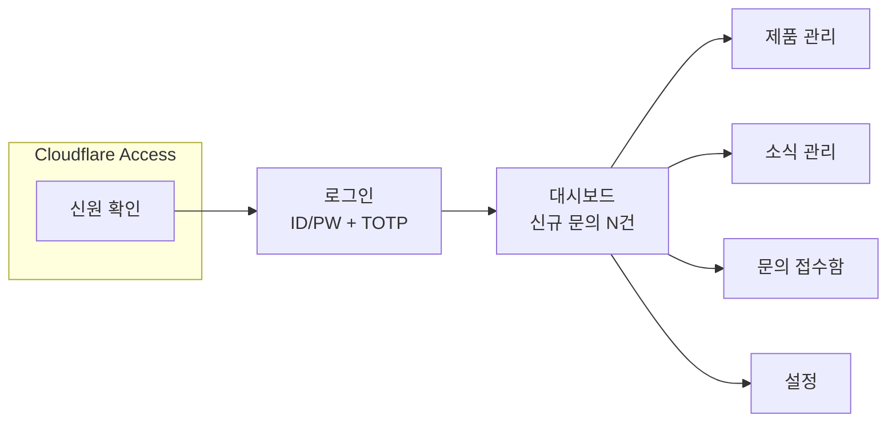

# 화면 설계

---

## 사이트맵



**모든 경로가 문의로 수렴합니다.** 이 사이트에서 문의가 아닌 종착지는 없습니다.

---

## 메인 — 스크롤 구조

```
스크롤 위치      구간                        상시 노출
─────────────────────────────────────────────────────
  0%   ┌──────────────────────────────┐   ┌─────────┐
       │ BORN IN SWEDEN               │   │ 견적·   │
       │ 스웨덴에서 온,               │   │ 무료시연│
       │ 공간을 아는 기구             │   │ 문의    │
       │ [무료 시연] [라인업 보기]    │   └─────────┘
       └──────────────────────────────┘    ↑ 우하단 고정
 10%   ┌──────────────────────────────┐    스크롤 내내
       │ "좋은 기구는 조용합니다"     │    사라지지 않음
       │ 브랜드 스테이트먼트          │
       └──────────────────────────────┘
 20%   ┌──────────────────────────────┐  ★ 핵심 구간
   ~   │  [핀 고정]        01 / 06    │
 70%   │  ┌────────┐  파워 랙         │
       │  │ 설치   │  POWER RACK      │
       │  │ 면적   │  2.6 m²  −38%    │
       │  │ 다이어 │  1400×1850×2300  │
       │  │ 그램   │  [자세히 보기 →] │
       │  └────────┘                  │
       │  스크롤 = 타임라인 (역재생)  │
       └──────────────────────────────┘
 70%   ┌──────────────────────────────┐
       │ 왜 짐레코인가 (3열)          │
       │ 본사직영 / 공간효율 / 오피셜 │
       └──────────────────────────────┘
 80%   ┌ 소식 3건 ────────────────────┐
 90%   ┌──────────────────────────────┐
       │ "공간을 알려주시면           │
       │  배치안을 함께 그려 드립니다"│
       │ [견적 문의] [무료 시연]      │
       └──────────────────────────────┘
100%   ┌ 푸터 (사업자정보·처리방침) ──┐
```

### 반응형 분기

| | 데스크톱 (≥768px) | 모바일 (<768px) |
|---|---|---|
| 제품 시퀀스 | 핀 고정 + 스크럽. 패널이 겹쳐 전환 | 세로 스택. 화면 밖 카드만 가볍게 페이드인 |
| 레이아웃 | 2열 (다이어그램 ↔ 텍스트) | 1열 |
| 진행 표시 | `01 / 06` 카운터 | 없음 |

**모바일이 주 트래픽일 가능성이 높습니다** (인스타 유입). 스크럽은 중급 안드로이드에서 버벅이므로 분기가 선택이 아니라 필수입니다.

### 연출이 꺼지는 경우



어느 경로로 빠지든 **최악의 결과가 "애니메이션 없는 목록"이지 "빈 화면"이 아니어야** 합니다.
이것이 이 페이지의 1순위 제약입니다.

---

## 문의 폼 — 가장 중요한 화면

```
┌───────────────────────────────────────────┐
│ 문의 유형   (●견적) (○무료시연) (○오피셜) │
│                                           │
│ 이름 *      [___________________]         │
│ 연락처 *    [___________________]         │
│ 이메일      [___________________]         │
│ 업체명      [___________________]         │
│ 지역        [▼ 선택            ]          │
│ 평수·천장고 [___________________]         │
│ 관심 제품   ☐파워랙 ☐케이블 ☐스미스…      │
│ 내용        [                   ]         │
│             [                   ]         │
│                                           │
│ ┌───── 개인정보 수집·이용 동의 ─────────┐ │
│ │ ☐ (필수) 수집·이용에 동의합니다      │ │
│ │    항목: 이름, 연락처, 이메일, 업체명 │ │
│ │    목적: 문의 응대 및 견적 안내       │ │
│ │    보유: 처리 완료 후 1년             │ │
│ │    → 자세히 보기 (처리방침)           │ │
│ │ ☐ (선택) 마케팅 정보 수신 동의       │ │
│ └───────────────────────────────────────┘ │
│                                           │
│ [ 문의 보내기 ]                           │
│                                           │
│ (숨김) honeypot 필드 — 봇만 채운다        │
└───────────────────────────────────────────┘
```

**설계 규칙**

- 필수 항목은 **이름·연락처·동의** 뿐. 최소 수집 원칙 (§14)
- 동의 체크박스는 **기본 해제**. 미리 체크해 두면 동의로 인정되지 않는다
- **마케팅 동의는 반드시 별도 항목**. 필수 동의에 묶으면 위법
- honeypot 은 UX 를 해치지 않는 봇 차단. reCAPTCHA 는 전환율을 고려해 2차
- IP 당 시간당 5건 rate limit

### 접수 흐름



메일 발송이 실패해도 **문의는 이미 저장돼 있어야 합니다.** 그래서 커밋 이후 비동기입니다.

---

## 관리자 화면



### 문의 접수함

```
┌──────────────────────────────────────────────────┐
│ 상태 [전체▼]  검색 [_______]  [CSV 내보내기]     │
├────┬──────┬────────┬──────────┬──────┬──────────┤
│상태│ 이름 │ 유형   │ 업체     │ 지역 │ 접수일   │
├────┼──────┼────────┼──────────┼──────┼──────────┤
│신규│ 김** │ 무료시연│ ○○피트니스│ 서울 │ 08-10    │
│연락│ 이** │ 견적   │ △△짐     │ 경기 │ 08-09    │
│완료│ 박** │ 견적   │ □□스튜디오│ 부산 │ 08-07    │
└────┴──────┴────────┴──────────┴──────┴──────────┘
```

**목록에서는 이름을 마스킹합니다.** 연락처는 상세 화면에서만 복호화해 보여주고,
그 조회 자체를 감사 로그에 남깁니다. 화면을 켜 두는 것만으로 개인정보가
노출되지 않게 하기 위해서입니다.

**CSV 내보내기**는 `ADMIN` 권한만 가능하며, 누가 언제 몇 건을 내보냈는지 기록합니다.
컬럼 암호화를 무력화하는 유일한 통로이기 때문입니다.

### 비개발자 기준

CMS 를 직접 만드는 이유는 대표님이 개발자 없이 운영하기 위해서입니다 (§4.1).
그 목적을 지키는 규칙:

- 화면에 "슬러그", "메타데이터" 같은 말을 쓰지 않는다
- 필수/선택을 명확히 구분한다
- 이미지 업로드에 권장 해상도를 안내한다
- 삭제·비공개 전환에는 확인창을 둔다
- 저장 전 미리보기를 제공한다
