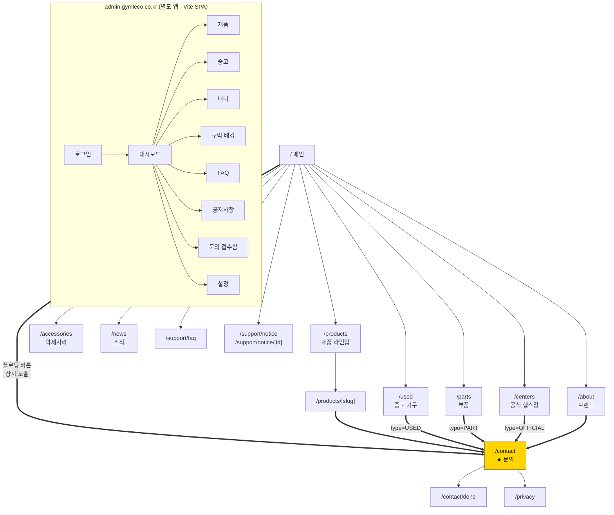
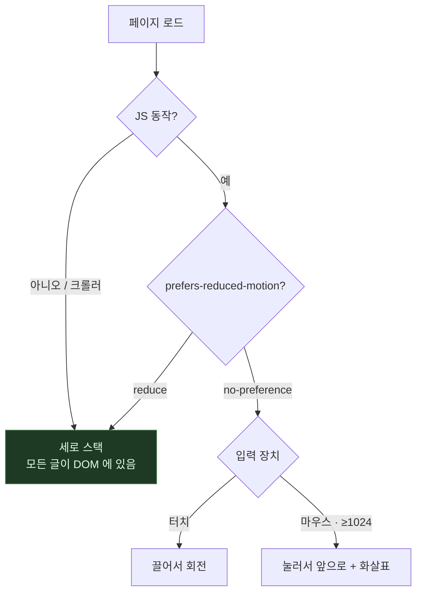
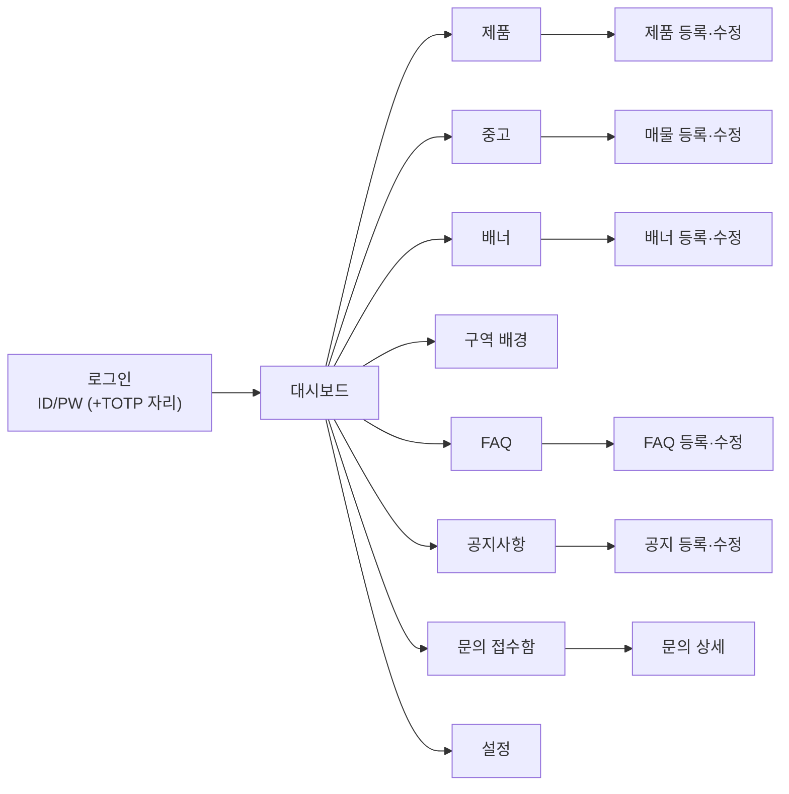

# 화면 설계

**기준: 2026-09-07 로컬 실행분 (`localhost:3111`).**

이 문서는 «만들 것» 이 아니라 **«지금 만들어져 있는 것»** 을 적습니다.
초안(Phase 1 연출 승인용)과 구현이 갈라진 곳이 많아, 화면을 직접 돌며
다시 썼습니다. 아직 안 만든 것은 만든 것과 섞지 않고 표로 따로 모읍니다.

색·타이포는 브랜드 가이드 수령 전이라 잠정입니다.

---

## 사이트맵 (실제 라우트)



공개 라우트 **15개**, Route Handler 2개(`/api/inquiries`, `/api/revalidate`).
**모든 경로가 문의로 수렴합니다.** 문의가 아닌 종착지는 없습니다.

### 초안과 달라진 것

| | 초안 | 지금 |
|---|---|---|
| 고객센터 | 없음 | `/support/faq`, `/support/notice`, `/support/notice/[id]` 추가 |
| 테마 | 다크 고정 | **다크 기본 + 밝은 테마 토글** (헤더 우측) |
| 메인 히어로 | 글 중심 | **기울어진 원판 위 기구 누끼** (직접 돌림) |
| 제품 시퀀스 | 핀 고정 스크럽 | 핀 고정 없음. 구역별 쇼케이스 + 모바일 사진 스와이프 |
| 메뉴 | 한 줄 + 가로 스크롤 | **세 묶음 드롭다운 + 모바일 서랍 아코디언** |

---

## 공통 요소

### 헤더 (`components/site-header.tsx` · `components/mobile-nav.tsx`)

메뉴 구조는 **`lib/nav.ts` 한 곳**에 있습니다. 데스크톱 드롭다운과 모바일
서랍이 같은 것을 읽습니다 — 두 곳에 적어 두면 반드시 갈라집니다.
실제로 예전에는 헤더에 「소식」이 없고 푸터에는 있었습니다.

| 묶음 | 눌렀을 때 | 하위 |
|---|---|---|
| **상품** | `/products` | 제품 라인업 · 중고 기구 · 부품 · 악세사리 |
| **브랜드** | `/about` | About Gymleco · 공식 헬스장 · 소식 |
| **고객센터** | `/contact` | 견적 문의 · 무료 시연 신청 · 자주 묻는 질문 · 공지사항 · 개인정보처리방침 |

방문자가 찾는 것은 «페이지» 가 아니라 셋 중 하나입니다 —
**무엇을 파는가 · 믿을 만한가 · 물어보고 싶다.**

「견적 문의」와 「무료 시연 신청」은 같은 `/contact` 로 가되 유형이 미리
잡힙니다(`?type=QUOTE|DEMO`). 폼에서 유형을 고르는 단계를 하나 줄입니다.

```
데스크톱 (≥1024px)
┌──────────────────────────────────────────────────────────────┐
│ GYMLECO                       상품▾  브랜드▾  고객센터▾  ☀  문의│
└──────────────────────────────────────────────────────────────┘
                               └ 제품 라인업
                                 중고 기구
                                 부품
                                 악세사리

모바일 · 태블릿 (<1024px)
┌──────────────────────────────────────────────────────────────┐
│ GYMLECO                                              ☀    ☰  │
└──────────────────────────────────────────────────────────────┘
        ☰ 를 누르면 오른쪽에서 서랍이 나옵니다

        ┌──────────────────────────┐
        │ GYMLECO              ✕   │
        ├──────────────────────────┤
        │ 상품                  ⌄  │
        │ 브랜드                ⌄  │
        │ 고객센터              ⌃  │
        │    견적 문의             │
        │    무료 시연 신청        │
        │    자주 묻는 질문  ←지금 │
        │    공지사항              │
        │    개인정보처리방침      │
        ├──────────────────────────┤
        │ [ 견적 · 무료 시연 문의 ]│
        └──────────────────────────┘
```

**한 줄에 늘어놓기를 그만둔 이유.** 예전에는 여섯 항목을 한 줄에 두고
넘치면 가로로 스크롤시켰습니다. 그때는 「항목이 잘려 보이는 것 자체가
더 있다는 신호」라고 적어 두었는데, 페이지가 열넷이 되면서 그 신호가
«메뉴가 끝없이 이어진다» 로 바뀌었습니다. 밀어 본 사람만 소식과
개인정보처리방침을 찾았습니다.

**드롭다운에 JS 를 쓰지 않습니다.** 헤더는 모든 페이지에 있으므로 서버
컴포넌트로 둡니다. `hover` 와 `focus-within` 이면 충분하고,
`focus-within` 이 있어야 키보드로도 열립니다. 묶음 이름 자체가 링크라
열리지 않아도 길이 막히지 않습니다.

**서랍은 `<details>` 입니다.** `useState` 로 여닫으면 JS 가 늦거나 죽었을
때 메뉴가 아예 안 열리고, 헤더가 유일한 이동 수단이라 사이트가 통째로
막힙니다. `<details>` 는 브라우저가 여닫으므로 수화 전에도 열립니다.
JS 는 **닫아 주는 일만** 얹습니다 — 없어도 손해가 없는 것만:

| JS 가 얹는 것 | 없으면 |
|---|---|
| 페이지 이동 후 자동으로 닫기 | 목적지가 서랍에 가려짐 |
| 바깥·Esc 로 닫기 | ✕ 버튼으로 닫음 |
| 열려 있는 동안 본문 스크롤 잠금 | 뒤가 같이 움직임 |

안쪽 아코디언도 `<details>` 라 접고 펴는 데 JS 가 필요 없습니다.
**지금 보고 있는 묶음만 펼쳐 둡니다** — 열넷을 다 펼치면 서랍을 열자마자
스크롤해야 하고, 다 접으면 내가 어디 있는지 알 수 없습니다.

**`z-[45]`.** 떠 있는 문의 버튼(`z-40`)보다 위, 「본문 바로가기」(`z-50`)
보다 아래입니다. sticky 헤더는 자체 쌓임 맥락을 만들어서, 서랍에 `z-50` 을
줘 봐야 바깥의 `z-40` 을 못 이깁니다 — 실제로 서랍 위로 문의 버튼이
겹쳐 떴습니다.

### 플로팅 문의 버튼 (`components/floating-cta.tsx`)

```
                                          ┌──────────────────┐
                                          │ 견적 · 무료 시연 │ ← 우하단 고정
                                          └──────────────────┘
```

스크롤 위치와 무관하게 항상 보입니다(기획서 §3.4-4).
**첫 화면에서만 비킵니다** — 거기엔 이미 큰 버튼 두 개가 있습니다.
`data-cta-anchor` 한 줄이 보이는 동안이 «첫 화면» 이고, 그동안 `yielded`
상태로 물러납니다. `/contact` 에서는 아예 숨깁니다.

### 푸터 (`components/site-footer.tsx`)

```
┌──────────────────────────────────────────────────────────────┐
│ GYMLECO         제품        브랜드        고객센터           │
│ 스웨덴 본사     제품 라인업  브랜드 소개   견적 문의          │
│ 직영.           중고 기구    공식 헬스장   무료 시연 신청     │
│ 공간을 아는     부품        소식          FAQ                │
│ 기구.           악세사리                  공지사항            │
│                                           개인정보처리방침    │
│ ──────────────────────────────────────────────────────────── │
│ 짐레코 코리아 · 대표자 — · 사업자등록번호 —                  │
│ 주소 — · 전화 — · 이메일 —              [SNS]               │
│ © 2026 GYMLECO KOREA                                         │
└──────────────────────────────────────────────────────────────┘
```

⚠️ **사업자 정보는 아직 비어 있습니다.** 대표님께 받아 채웁니다.
개인정보처리방침 링크는 문의 폼을 여는 시점에 반드시 살아 있어야 합니다.

### 테마

기본이 **어두운 테마**입니다. 속성이 없을 때가 다크이고,
`:root[data-theme="light"]` 일 때만 밝아집니다.

색은 전부 토큰으로 씁니다(`globals.css`). 두 테마에서 값이 갈리는 대표적인 것:

| 토큰 | 다크 | 라이트 | 이유 |
|---|---|---|---|
| `--color-accent` | 브랜드 노랑 | `#8a5a00` | 글자로 쓰는 노랑은 밝은 바탕에서 안 읽힘 |
| `--shadow-lift` | 검정 65% | 검정 20% | 밝은 바탕에서 65% 는 때가 낀 것처럼 보임 |
| `--cutout-lift` | 흰 테두리 + 밝기 1.6 | 그림자만 | 아래 «원판» 항목 참고 |

---

## `/` 메인 ★ 핵심

```
스크롤   구간                                        상시 노출
──────────────────────────────────────────────────────────────
  0%   ┌────────────────────────────────────────┐  ┌──────────┐
sticky │ GYMLECO  제품 중고 …  고객센터▾ ☀ 문의 │  │ 견적·    │
       │                                        │  │ 무료시연 │
       │            ╭─ 기구 누끼 ─╮             │  └──────────┘
       │        ◜───┤  (5대가     ├───◝         │   ↑ 첫 화면에선
       │       ◟────╰─ 원판 위에)─╯────◞        │     비켜 있음
       │            디와이 로우                 │
       │        설치 면적 2.6m² · 0.8평         │
       │   좌우가 따로 움직이는 플레이트 로딩…  │
       │        ← 끌어서 돌려 보세요 →          │
       │                                        │
       │ BORN IN SWEDEN                         │
       │ 스웨덴에서 온,                         │
       │ 공간을 아는 기구                       │
       │ 본사 직영이라 중간 마진이 없습니다…    │
       │ [무료 시연 신청] [제품 라인업 보기]    │
       │ SCROLL                                 │
       └────────────────────────────────────────┘
 10%   ┌ 브랜드 스테이트먼트 ───────────────────┐
       │ "좋은 기구는 조용합니다. 흔들리지 않고,│
       │  자주 고장 나지 않고, 필요 이상으로    │
       │  자리를 차지하지 않습니다."            │
       │  짐레코는 1985년부터…                  │
       └────────────────────────────────────────┘
 30%   ┌ 제품 라인업 (쇼케이스) ────────────────┐
       │  [면적 다이어그램]  머신               │
       │   짐레코 2.6m²      디와이 로우        │
       │   평균  4.2m²       D.Y. ROW           │
       │   −38%              설치면적 / 치수 /  │
       │                     중량               │
       │                     [제품 자세히 보기] │
       └────────────────────────────────────────┘
 65%   ┌ 왜 짐레코인가 ────────────────────────┐
       │ DIRECT FROM SWEDEN / SPACE EFFICIENT / │
       │ OFFICIAL CENTER                        │
       │ [무료 시연 신청]        (배경: home.why)│
       └────────────────────────────────────────┘
 85%   ┌ 짐레코 소식 ──────────────────────────┐
       │ (지금은 «등록된 소식이 아직 없습니다») │
       └────────────────────────────────────────┘
 95%   ┌ 마무리 CTA ───────────────────────────┐
       │ 공간을 알려주시면                      │
       │ 배치안을 함께 그려 드립니다            │
       │ [견적 문의하기] [무료 시연 신청]       │
       │                        (배경: home.cta)│
       └────────────────────────────────────────┘
100%   ┌ 푸터 ─────────────────────────────────┐
```

### 히어로 — 라인업 원판 (`components/home/lineup-disc.tsx`)

기울어진 원판(`TILT = 0.34`) 위에 기구 누끼가 서 있고, 돌려 볼 수 있습니다.

**CSS 3D(`preserve-3d`)를 쓰지 않습니다.** 자식에 `filter`·`opacity` 를 걸면
평탄화되고 브라우저마다 쌓임 순서가 달라집니다. 원 위의 좌표를 직접 계산해
`translate`·`scale`·`opacity` 만 씁니다 — 앞뒤 순서를 우리가 통제합니다.

| | 데스크톱 (≥1024px & pointer:fine) | 모바일 · 터치 |
|---|---|---|
| 조작 | **기구를 눌러 앞으로** + 좌우 화살표 + 방향키 | **끌어서 회전** (관성 + 칸 스냅) |
| 끌기 | 끕니다 — 원판이 화면을 채워 «어디를 잡나» 가 애매 | 켬 |
| 힌트 | "기구를 누르면 앞으로 옵니다" | "← 끌어서 돌려 보세요 →" |
| 설명 위치 | 원판 우상단 | 원판 아래 가운데 |

- 힌트는 **한 번 만지면 사라집니다.** 역할을 다했기 때문입니다.
- 설명 칸은 **높이를 고정**합니다(`min-h-[5.5rem]`). 설명 길이가 제품마다
  달라 그대로 두면 돌릴 때마다 아래 버튼이 위아래로 튑니다.
- 원 배치는 **수화가 끝난 뒤에만** 켭니다(`useSyncExternalStore`).
  그 전에는 기구가 그냥 가로로 놓입니다 — JS 가 죽어도 최악이
  «안 도는 목록» 이지 «빈 화면» 이 아닙니다.
- 각도 계산에 `Math.round(v*1000)/1000` 을 씁니다. `Math.sin` 의 마지막
  자리가 Node 와 브라우저에서 달라 하이드레이션 불일치가 났습니다.

#### 누끼 사진 표시 — `--cutout-lift`

기구가 **통째로 검정**이라 어두운 테마에서 바탕에 그대로 묻었습니다.
그림자로는 해결되지 않습니다 — 검정 위의 검정 그림자는 보이지 않습니다.

```
다크   brightness(1.6) contrast(0.88)
       + drop-shadow(0 0 1px  rgb(255 255 255 / .62))   ← 실루엣 한 겹
       + drop-shadow(0 0 18px rgb(255 255 255 / .15))   ← 은은한 분리
라이트 drop-shadow(0 14px 22px rgb(8 9 10 / .22))       ← 띄우기만
```

누끼가 아직 없는 제품은 **설치 면적 타일**(누운 직사각형)이 대신 섭니다.
세로로 세운 블록으로 그렸더니 막대그래프처럼 읽혀 눕혔습니다.

#### 크기 — 좁은 화면이 어려운 이유

이 상자는 정사각형이고 **높이로 크기가 정해집니다.** 375px 화면에서는
히어로 글(342px)이 세로를 다 먹어 원판이 **216px** 밖에 안 됐습니다 —
좌우로 111px 이 그냥 비어 있었습니다.

높이를 더 뺏으려면 첫 화면 문구를 깎아야 하므로, 대신 원판 중심을 기준으로
**1.75배**로 넓혔습니다.

| | 칸 크기 | 정면 기구 (375px 화면) |
|---|---|---|
| 타일 시절 | 지름의 19% | 88px |
| 지금 | 지름의 27% (모바일 최소 7.5rem × 1.75) | **210px** |

**여기가 한계입니다.** 정면 기구가 설 수 있는 세로는 헤더 아래(67px)부터
제품명 위(340px)까지가 전부고, 210px 일 때 위아래 여유가 16px · 4px 입니다.
더 키우려면 히어로 문구를 줄여야 합니다.

키우니 5대가 겹쳐 «무엇이 주인공인지» 가 사라져서, **좁은 화면에서만**
깊이 대비를 세게 걸었습니다(`opacity 0.14+depth*0.86`, 흐림 임계 0.9).
넘친 만큼은 `overflow-x: clip` 으로 잘라 냅니다 — `hidden` 은 스크롤
컨테이너를 만들어 위쪽 sticky 히어로를 깹니다.

### 제품 쇼케이스 (`components/home/product-showcase.tsx`)

| | 데스크톱 | 모바일 |
|---|---|---|
| 사진 | 좌측 고정 | **가로 스와이프** (인스타 게시물처럼) |
| 전환 | — | `scroll-snap-x mandatory` — 관성은 브라우저가 처리 |
| 표시 | — | 점(dot). **누를 수도 있습니다** |
| 설명 | 우측 | 사진 아래 (스와이프해도 같은 자리) |

`IntersectionObserver` 가 어느 사진이 보이는지 읽어 점을 맞춥니다.
**JS 없이도 스와이프는 됩니다** — 스냅은 CSS 가 합니다.

### 연출이 꺼지는 경우



어느 경로로 빠지든 **최악이 «애니메이션 없는 목록» 이지 «빈 화면» 이
아니어야** 합니다. 이 페이지의 1순위 제약입니다.
`gsap.from` 처럼 «먼저 숨기고 트리거를 기다리는» 패턴은 쓰지 않습니다.

---

## `/products` — 제품 라인업

```
┌──────────────────────────────────────────────────────────┐
│ PRODUCTS                                                 │
│ 제품 라인업                                              │
│ 20~30평 공간에도 라인업을 온전히 갖출 수 있도록…         │
│                                    (배너: PRODUCT 위치)  │
│ [전체][랙][머신][케이블][벤치][유산소]  ← 분류 필터      │
│ ┌──────────┬──────────┬──────────┐                       │
│ │ 머신     │ 머신     │ 머신     │                       │
│ │ 디와이   │ 시티드…  │ 숄더     │                       │
│ │ 로우     │          │ 로테이션 │                       │
│ │ 2.6m²    │ 3.1m²    │ 2.4m²    │                       │
│ └──────────┴──────────┴──────────┘                       │
│ 공간 크기와 천장 높이만 알려주시면…  [배치안 문의하기]   │
└──────────────────────────────────────────────────────────┘
```

- 분류는 `STRENGTH / CABLE / RACK / BENCH / CARDIO` 를 한글 라벨로 보여 줍니다.
- 카드마다 **설치 면적을 m² 와 평으로 함께** 적습니다. 이 사이트가 설득하는
  근거가 면적이므로 카드에서부터 보입니다.
- 배너가 없으면 **아무것도 걸지 않습니다.** 빈 상자를 남기면
  «만들다 만 화면» 이 됩니다(`lib/banner-source.ts`).

## `/products/[slug]` — 제품 상세

```
┌──────────────────────────────────────────────────────────┐
│ 제품 › 머신 › 디와이 로우                                │
│ 머신                                                     │
│ 디와이 로우 / D.Y. ROW                                   │
│ 좌우가 따로 움직이는 플레이트 로딩 로우.                 │
│ ┌ 설치 면적 2.6m² ┬ 1400×1850×2300mm ┬ 210kg ┐           │
│ [이 제품 견적 문의]  [무료 시연 신청]                    │
│                                                          │
│ ┌ 설치 공간 비교 ──────────────────────────┐             │
│ │ 짐레코 2.6m²(0.8평) ▨▨▨                  │             │
│ │ 일반 평균 4.2m²(1.3평) ▨▨▨▨▨            │  −38%       │
│ └──────────────────────────────────────────┘             │
│ 같은 운동을 하는 일반 상업용 기구의 평균은 4.2m² 입니다… │
│                                                          │
│ 제품 설명 (관리 화면에서 입력한 살균 HTML)               │
│ 함께 보는 제품 ▸ ▸ ▸                                     │
└──────────────────────────────────────────────────────────┘
```

- 설명은 **서버가 살균한 HTML** 만 `dangerouslySetInnerHTML` 에 넣습니다.
- «−38%» 비교 문구는 숫자를 그대로 읽어 문장으로 만듭니다. 도넛·막대만
  두면 «그래서 얼마나 좋은지» 가 안 남습니다.

## `/used` — 중고 기구

```
┌──────────────────────────────────────────────────────────┐
│ USED   중고 기구           현재 판매중 3 건              │
│ 센터 리뉴얼이나 폐업으로 회수한 기구를 점검·정비 후…     │
│ ┌ 상태 등급 기준 ────────────────────────┐               │
│ │ A 상급 / B 중급 / C 하급  + 각 설명    │               │
│ └────────────────────────────────────────┘               │
│ ┌──────────┬──────────┬──────────┐                       │
│ │ 판매중   │ 예약중   │ 판매완료 │  ← 상태 배지          │
│ │ A급      │ B급      │ A급      │                       │
│ │ 파워 랙  │ 스미스…  │ 레그…    │                       │
│ │ 2021년식 │ 2018년식 │ 2020년식 │                       │
│ │ 가격 문의│ 가격 문의│          │                       │
│ └──────────┴──────────┴──────────┘                       │
│ 재고는 수시로 바뀝니다  [중고 문의 · 입고 알림]          │
│ 기구를 처분하셔야 한다면 — 매입 상담                     │
└──────────────────────────────────────────────────────────┘
```

가격은 전부 **«가격 문의»** 입니다. 공개 정책이 정해지기 전이라
숫자를 노출하지 않습니다(OPEN-DECISIONS).

## `/parts` · `/accessories`

같은 뼈대(`catalog-grid`)를 쓰고 문구만 다릅니다. 치수가 없어도 되므로
스키마에서 EQUIPMENT 만 치수를 필수로 받습니다.

`/parts` 에는 «어떤 부품이 필요한지 모르시겠다면» 3단계 안내가 붙습니다 —
증상 → 사진 한 장 → 교체 주기. 부품은 **모델명을 모르는 채로 문의가
들어온다**는 전제입니다.

## `/centers` — 짐레코 공식 헬스장

지역(서울/경기/부산…)으로 묶어 보여 주고, 센터마다 규모·도입 시기·
도입 기구를 답니다. 아래에 «오피셜 센터 제도» 안내(공식 사이트 노출 /
시연 거점 / 운영 지원)와 신청 CTA.

> **센터 정보는 각 센터의 게재 동의를 받아 표시합니다.**
> DB 제약 `ck_official_center_consent` 가 동의 없는 센터의 공개를 막습니다.

## `/news`, `/support/notice`, `/support/faq`

| 화면 | 지금 상태 |
|---|---|
| `/news` | **정적 마크업.** 소식이 없어 «등록된 소식이 아직 없습니다» + 문의 유도 |
| `/support/notice` | API 연동. 고정 공지 배지 + 날짜 |
| `/support/notice/[id]` | API 연동. 살균 HTML 본문 |
| `/support/faq` | API 연동. 분류별 아코디언 |

빈 상태에서 «없음» 만 두지 않습니다 — **왜 비었는지 + 다음 행동**을 답니다.

## `/about` — 브랜드

스토리 → 세 가지 축(내구성 / 공간 효율 / 운동감) → 한국 총판(직영이라
중간 마진 없음 · 부품 경로 짧음 · 기술 자료 직수령) → «기구는 써봐야
압니다» → CTA.

**«디지털 기능을 원하신다면 다른 선택지가 더 나을 수 있습니다»** 라고
적습니다. 안 하는 것을 밝히는 편이 하는 것을 더 믿게 만듭니다.

## `/contact` ★ 가장 중요한 화면

```
┌──────────────────────────────────────────────────────────┐
│ CONTACT                                                  │
│ 공간을 알려주시면 배치안을 함께 그려 드립니다            │
│                                                          │
│ 문의 유형  [견적 문의][무료 시연][오피셜 센터][중고][부품]│
│ 이름*      [________________]                            │
│ 연락처*    [________________]                            │
│ 이메일     [________________]                            │
│ 업체명     [________________]                            │
│ 지역       [선택 ▾]  (서울·경기·…·제주)                  │
│ 평수·천장  [________________]                            │
│ 관심 제품  ☐ 디와이 로우  ☐ 시티드 와이드 체스트 프레스 …│
│ 문의 내용  [                    ]                        │
│            [ 이 칸은 비워두세요 ]  ← 허니팟(화면에 없음) │
│                                                          │
│ ☐ (필수) 개인정보 수집·이용에 동의합니다                 │
│    항목 / 목적 / 보유기간을 그 자리에 적음               │
│ ☐ (선택) 신제품·행사 정보 수신에 동의합니다              │
│                                                          │
│ [ 문의 보내기 ]                                          │
│ 응대 시간 · 무료 시연 · 개인정보  (3단 안내)             │
└──────────────────────────────────────────────────────────┘
```

- **필수/선택 동의를 분리**합니다. 마케팅 수신에 동의하지 않아도 응대에는
  영향이 없다고 그 자리에 적습니다.
- 수집 **항목 · 목적 · 보유기간**을 체크박스 옆에 그대로 적습니다.
  «개인정보처리방침 보기» 링크만 두면 아무도 안 봅니다.
- 허니팟 한 칸으로 자동 등록을 거릅니다.
- 다른 화면에서 오면 유형이 미리 잡힙니다 — `?type=QUOTE|DEMO|OFFICIAL|USED|PART`.
- 제출은 `/api/inquiries` Route Handler 를 거칩니다. 브라우저가 백엔드를
  직접 부르지 않습니다.

### `/contact/done`

```
              문의가 접수되었습니다
   담당자가 영업일 기준 1일 이내에 연락드리겠습니다.
    급하시면 전화로 문의해 주세요 — (설정에 번호가 있을 때만)
        [제품 더 보기]   [홈으로]
```

- **언제 연락이 가는지 반드시 적습니다.** 기다림이 불안하면 다른 업체에도
  문의하게 됩니다.
- 대체 경로(전화)를 같이 둡니다. **번호는 관리 화면 설정에서 옵니다.**
  값이 없으면 그 줄을 아예 내보내지 않습니다 — 「급하시면 전화 주세요」
  밑에 안 받는 번호가 적혀 있는 것이 아무 번호도 없는 것보다 나쁩니다.
- 뒤로 가기로 재제출되지 않도록 별도 라우트로 뺐고, 검색에 노출될 이유가
  없으므로 색인에서 뺍니다.

## `/privacy`

9개 항목(수집 항목 / 목적 / 보유기간 / 파기 / 제3자 / 안전성 / 권리 /
보호책임자 / 시행일).

> ⚠️ 지금은 **초안**입니다. 사업자 정보와 개인정보 보호책임자 지정 후
> 정식 게시합니다. 화면 상단에 그 사실을 적어 두었습니다.

---

## 데이터가 어디서 오는가

이 구분이 «지금 보이는 것» 과 «곧 바뀔 것» 을 가릅니다.

| 화면 | 출처 | 비고 |
|---|---|---|
| 제품 목록 · 상세 | **API** (`/api/products`) | 실데이터 |
| 배너 | **API** (`/api/public/banners`) | 위치별 |
| 구역 배경 | **API** (`/api/public/section-media`) | `home.why`, `home.cta` |
| 사이트 설정 | **API** (`/api/public/settings`) | 상호 · 연락처 |
| FAQ · 공지사항 | **API** (`/api/public/support/*`) | 실데이터 |
| 중고 | `lib/used.ts` **하드코딩** | 샘플 배지 표시 |
| 공식 헬스장 | `lib/centers.ts` **하드코딩** | 샘플 배지 표시 |
| 소식 | 정적 마크업 | API 없음 |

- API 가 죽으면 `lib/catalog.ts` 자리표시자로 **폴백**합니다. 빌드 시점에
  API 가 잠깐 죽으면 페이지 생성이 전부 실패해 사이트가 통째로 안 뜹니다.
  오래된 내용이라도 보이는 편이 낫습니다.
- 폴백했다는 사실을 **«샘플 데이터» 배지**로 화면에 드러냅니다.
  가짜 수치가 진짜처럼 보이는 것이 이 사이트에서 가장 위험합니다.
- 캐시는 **ISR 300초**. 관리 화면에서 저장하면 `/api/revalidate` 가
  해당 태그를 즉시 무효화합니다.

---

## 관리자 화면 (`admin.gymleco.co.kr`)



공개 사이트와 **한 앱으로 합치지 않습니다.** 오리진이 분리돼 있어야
CSP 를 따로 걸 수 있고, 관리자 번들이 공개 사이트에 실리지 않습니다.
API 는 **상대 경로 `/api/*`** 로만 부릅니다.

### 로그인

**실패 메시지를 구분하지 않습니다.** «없는 아이디» 와 «비밀번호 틀림» 을
나누면 계정 존재 여부가 새어 나갑니다. 남은 시도 횟수만 알려 줍니다 —
«4회 더 틀리면 계정이 잠깁니다».

### 대시보드

지표를 늘어놓지 않습니다. 들어온 사람이 알고 싶은 것은
**«지금 손봐야 할 게 있나»** 이지 «전체 몇 개인가» 가 아닙니다.

```
┌──────────────────────────────────────────────────┐
│ 답을 기다리는 문의 3건          [문의함 열기]    │ ← 맨 위
│  견적  홍*동 · ○○피트니스           3시간 전    │
├──────────────────────────────────────────────────┤
│ 제품              │ 중고                         │
│ 보임 5  감춤 1    │ 보임 3  감춤 0               │
│ 등록만 하고 아직  │                              │
│ 안 보이는 제품 1개│                              │
├──────────────────────────────────────────────────┤
│ 최근에 손댄 것                                   │
└──────────────────────────────────────────────────┘
```

문의가 제일 위입니다. **보이지 않는 제품은 하루 늦어도 아무 일도 안
일어나지만, 답 없는 문의는 하루 늦으면 그 사람이 다른 데로 갑니다.**
문의를 못 불러와도 대시보드 전체를 막지 않되, 조용히 넘기지도 않습니다.

### 배너

**위치별로 묶어서** 보여 줍니다. 한 목록에 늘어놓으면 «메인에 지금 뭐가
걸려 있지» 를 눈으로 세야 합니다. 배너는 개수보다 «어느 자리에 무엇이» 가
중요합니다.

기간이 지난 배너를 **화면이 먼저 말해 줍니다.** 서버는 기간을 넘긴 배너를
공개 API 에서 빼지만 관리 화면에서는 여전히 «보임» 이라, 사이트에 안 나오는
이유를 알 수 없습니다. 그 차이를 `liveState()` 가 메웁니다 —
`지금 나감 / 감춤 / 시작 전 / 기간 지남`.

### 사진 올리기 (`components/image-picker.tsx`)

- 권장 해상도를 **화면에 적습니다** — «가로 1200px 이상 권장 · JPG 또는
  PNG · 10MB 이하». 안 적으면 4000px 사진이 그대로 올라오고, 반대로
  800px 짜리를 올려 놓고 왜 흐린지 묻게 됩니다.
- 올린 파일을 그대로 쓰지 않습니다. 서버가 시그니처를 확인하고 다시
  인코딩해 **400 · 800 · 1600** 세 벌을 만듭니다. 화면이 들고 있는 값은
  파일이 아니라 **키 하나**(`p/uuid.png`)뿐입니다.
- 알파가 있으면 PNG, 없으면 JPEG 로 나갑니다. 누끼가 PNG 로 유지되는 이유.
- 누끼용 자리는 미리보기 바탕을 **체크무늬**로 깔아 투명을 보여 줍니다.
- 실패를 조용히 넘기지 않습니다. 서버가 돌려준 문장을 그대로 보여 줍니다.

**PC 와 모바일 사진을 따로 받습니다.** 한 장으로 양쪽을 덮으면 반드시 한쪽이
잘립니다 — 가로로 넓은 사진을 세로 화면에 깔면 가운데만 크게 잘리고,
반대는 위아래가 텅 빕니다. 서버도 둘 다 필수로 받습니다.

### 문의 접수함 ★ 개인정보

- 목록에서는 **가린 이름**(`홍*동`)만 보여 줍니다.
- 상세를 열어야 연락처가 보이고, **조회 이력이 남습니다**(`admin_audit_log`).
- CSV 내보내기는 수식 주입(`=` `+` `-` `@`)을 이스케이프하고, 내보낸 사실을
  감사 로그에 남깁니다.
- 로그에 비밀번호 · 토큰 · 개인정보를 남기지 않습니다.

### 지우기 전에 되묻기

되돌릴 수 없는 동작에는 «무엇이 사라지는지» 를 문장으로 적습니다.

> **○○ 자리의 「가을 입고전」 이 사라집니다. 되돌릴 수 없습니다 —
> 잠시 내리는 것이라면 «수정» 에서 감추기를 쓰세요.**

---

## 반응형 기준

| 구간 | 폭 | 비고 |
|---|---|---|
| 모바일 | < 768px | **주 트래픽 가정** (인스타 유입) |
| 태블릿 | 768–1023px | 2열 그리드. 원판은 모바일과 같은 확대를 씁니다 |
| 데스크톱 | ≥ 1024px | 3열 그리드. 원판 조작이 «눌러서 앞으로» 로 바뀜 |

원판의 분기점만 `1024px` **이면서 `pointer: fine`** 입니다. 폭만 보면
터치 노트북에서 끌기가 꺼집니다.

관리자 화면은 **태블릿 이상**을 기준으로 합니다 — 대표님이 폰으로 제품을
등록하실 일은 없지만 문의 확인은 폰에서 하실 수 있으므로,
**문의 목록·상세만 모바일 대응**합니다.

---

## 전 화면 공통 상태

새 화면을 만들 때 이 네 가지를 항상 정의합니다. 하나라도 빠지면
사용자가 막다른 길에 놓입니다.

| 상태 | 규칙 |
|---|---|
| **로딩** | 스피너보다 스켈레톤. 레이아웃이 흔들리지 않게 |
| **빈 상태** | 왜 비었는지 + 다음 행동 제시. «없음» 만 두지 않는다 |
| **오류** | 무엇이 잘못됐는지 + **대체 경로**(전화번호 등) |
| **권한 없음** | 관리자 화면에서 401 이면 로그인으로. 흰 화면 금지 |

---

## 접근성 (전 화면)

- 모든 이미지에 `alt`. 장식용은 `alt=""` — 원판 기구도 장식이므로 빈 alt 에
  `aria-hidden` 입니다. 이름은 그 아래 글이 말합니다.
- 원판을 **방향키로도** 돌릴 수 있어야 합니다. 끌기만 되면 키보드 사용자는
  못 씁니다.
- 원판 위 기구는 `<button>` 입니다 — 마우스만이 아니라 탭·엔터로도 닿아야
  합니다. 이미 앞에 있는 기구는 누를 것이 없으므로 `disabled`.
- 포커스 표시를 지우지 않습니다 (`:focus-visible` 유지).
- 본문 대비 4.5:1, 큰 글자·비텍스트 3:1 이상.
  원판 바깥 링을 브랜드색으로 또렷하게 둔 이유가 이것입니다 —
  `ink-600` 으로는 바탕과 2:1 도 안 나와 «기울어진 판» 이 안 보였습니다.
- **«본문 바로가기»** 링크로 긴 연출을 건너뛸 수 있게 합니다.
- 색만으로 정보를 전달하지 않습니다 (공개/비공개는 아이콘+텍스트 병기).

---

## 아직 안 된 것

미팅(9/9) 전에 이 표가 화면과 어긋나면 그건 문서가 아니라 화면 쪽 문제입니다.

| 항목 | 상태 | 막고 있는 것 |
|---|---|---|
| 제품 상세 사진 | **없음** | 제품당 2~3장 필요. 지금은 누끼만 있고 상세 갤러리는 빈 상태 |
| 제품 치수 | **샘플 값** | 「디와이 로우 2.6m²」 는 옛 파워 랙 값. 실제 스펙 시트 필요 |
| 제품 설명 | **`<p>수정됨</p>`** | 테스트 입력이 그대로 남아 있음 |
| 누끼 2장 | 미사용 | `Gi-020-1`, `Gi-038` 모델명 미확인 |
| 「어저스터블 벤치」 | **감춤** | 사진 없음. 감춘 것이라 관리 화면에서 되돌릴 수 있음 |
| 공식 헬스장 API | 없음 | 엔티티만 있음. Repository~Controller 미작성 |
| 소식 API | 없음 | 테이블만 있음 |
| MAIN 배너 자리 | 미연결 | 홈 히어로가 원판이라 어디에 걸지 설계 필요 |
| 대표 전화번호 | 미입력 | 관리 화면 «설정» 에 넣으면 접수 완료·전송 실패 안내에 바로 나옵니다 |
| 사업자 정보 · 개인정보 보호책임자 | 없음 | 대표님 확인 대기 |
| 로고 원본 · 브랜드 가이드 | 없음 | 대표님 확인 대기 |
| 가격 공개 정책 | 미정 | 지금은 전부 «가격 문의» |
| 관리자 2단계 인증 | 자리만 | `LoginRequest.totpCode` 는 있으나 검증 로직 없음 |

### 배포 전 지울 것

- `tester` 계정
- 배너 1「9월 신규 입고」(이미지 키 404) · 2「지난 행사」 · 3「가을 입고전」
- `home.why` 테스트 이미지
- 중고 · 공식 헬스장 · 소식 샘플 데이터
- nginx SPA 폴백(`try_files $uri /index.html`) 확인
- `AUTH_COOKIE_SECURE=true` 확인
