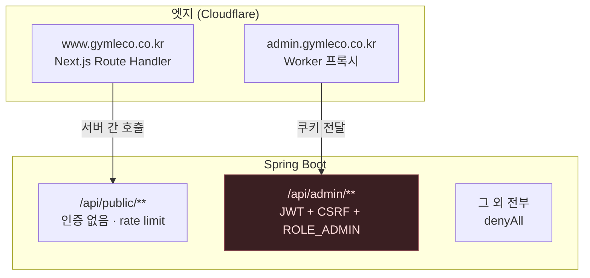
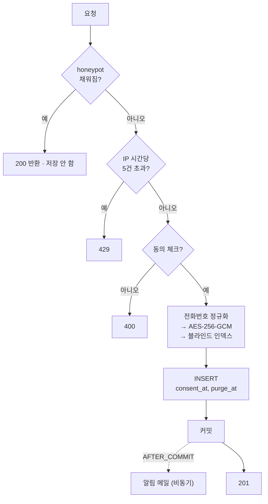
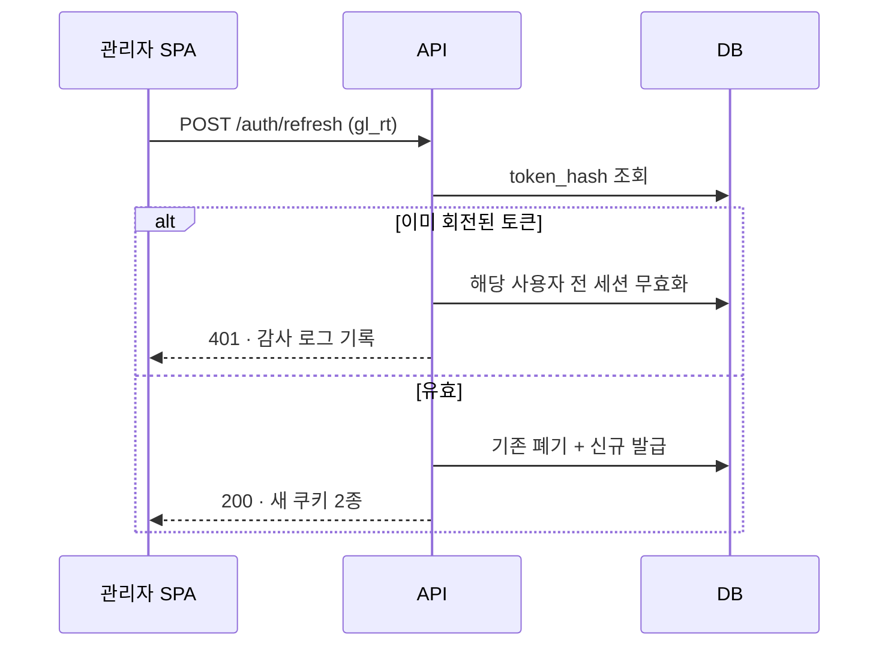
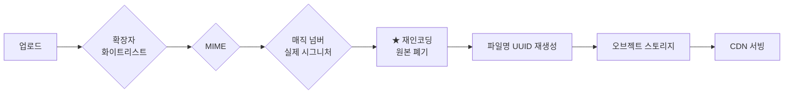

# API 명세

기준: Spring Boot 4.1.0 / Java 21. 구현은 `BE`.

---

## 경로가 곧 보안 경계다



**두 겹으로 막습니다.**

1. **엣지** — `www.` 는 `/api/public/**` 만, `admin.` 은 `/api/admin/**` 만 통과시킵니다.
   공개 경로에서는 관리 엔드포인트에 **URL 자체가 닿지 않습니다.**
2. **애플리케이션** — `SecurityFilterChain` 이 경로별로 갈라져 있어
   `/api/admin/**` 아래 무엇을 추가하든 기본이 "인증 + ADMIN" 입니다.

세 번째 체인이 나머지 전부를 `denyAll` 합니다.
**새 엔드포인트를 만들면서 등록을 잊으면 열리는 게 아니라 막힙니다.**

---

## 공통 규약

| 항목 | 값 |
|---|---|
| 형식 | JSON (UTF-8) |
| 시각 | ISO-8601 `2026-08-10T14:03:00+09:00` |
| 인증 | HttpOnly 쿠키 `gl_at` (Access) / `gl_rt` (Refresh) |
| CSRF | 관리 API 만. `XSRF-TOKEN` 쿠키 → `X-XSRF-TOKEN` 헤더 |
| 오류 | `{ "code": "...", "message": "..." }` |

**오류 응답에 내부 정보를 넣지 않습니다.** 스택 트레이스·SQL·클래스명이
나가지 않도록 `server.error.include-*` 를 전부 꺼 두었습니다.

| 코드 | 상황 |
|---|---|
| `400 VALIDATION_FAILED` | 입력 검증 실패 |
| `401 UNAUTHENTICATED` | 토큰 없음/만료 |
| `403 FORBIDDEN` | 권한 부족, CSRF 불일치 |
| `404 NOT_FOUND` | 대상 없음 |
| `429 RATE_LIMITED` | 요청 한도 초과 |

---

## 공개 API — `/api/public/**`

브라우저가 직접 호출하지 않습니다. Next.js 서버가 대신 부릅니다.

### 제품

```http
GET /api/public/products?category=RACK
```
```json
{
  "items": [
    {
      "slug": "power-rack",
      "nameKo": "파워 랙",
      "nameEn": "Power Rack",
      "category": "RACK",
      "summary": "프리웨이트의 중심. 한 대로 스쿼트부터 풀업까지.",
      "footprintM2": 2.60,
      "widthMm": 1400, "depthMm": 1850, "heightMm": 2300,
      "weightKg": 210.00,
      "thumbnailUrl": "https://cdn.gymleco.co.kr/p/xxxx.webp"
    }
  ]
}
```

`visible = false` 인 제품은 **응답에 포함되지 않습니다.** 필터가 아니라
쿼리 조건입니다 — 클라이언트가 우회할 수 있는 형태로 두지 않습니다.

```http
GET /api/public/products/{slug}
```
상세 + 갤러리 + 관련 제품.

`type` 으로 품목을 가릅니다. 설치 면적은 `EQUIPMENT` 에만 있습니다.

```http
GET /api/public/products?type=EQUIPMENT     # 기구
GET /api/public/products?type=PART          # 부품
GET /api/public/products?type=ACCESSORY     # 악세사리
```

### 중고 매물

```http
GET /api/public/used
GET /api/public/used/{slug}
```
```json
{
  "items": [
    {
      "slug": "used-power-rack-01",
      "nameKo": "파워 랙",
      "productSlug": "power-rack",
      "conditionGrade": "A",
      "yearMade": 2021,
      "priceKrw": null,
      "quantity": 1,
      "status": "AVAILABLE"
    }
  ]
}
```

- **판매완료 매물도 반환합니다.** 목록에서 지우지 않고 뒤로 보냅니다 —
  팔린 것이 보여야 "물건이 도는 곳"으로 읽힙니다
- `priceKrw` 가 `null` 이면 화면에 "가격 문의" 로 표시합니다.
  0 이나 빈 문자열로 내리지 않습니다

### 공식 헬스장

```http
GET /api/public/centers?region=서울
```

**`consent_at` 이 있는 센터만 반환합니다.** DB CHECK 로도 막혀 있지만
쿼리 조건에도 명시합니다 — 방어는 한 겹에 의존하지 않습니다.

### 소식

```http
GET /api/public/news?page=0&size=10
GET /api/public/news/{slug}
```

`visible = true AND published_at <= now()` 만 반환합니다.
예약 발행 글이 새어 나가지 않습니다.

### 사이트 설정

```http
GET /api/public/settings
```
연락처·SNS·히어로 구성. **공개해도 되는 키만 화이트리스트로** 내보냅니다.
`site_setting` 을 통째로 반환하면 내부용 키까지 나갑니다.

### 문의 접수 ★

```http
POST /api/public/inquiries
```
```json
{
  "type": "DEMO",
  "name": "홍길동",
  "phone": "010-1234-5678",
  "email": "hong@example.com",
  "company": "○○피트니스",
  "region": "서울",
  "productSlugs": ["power-rack", "cable-crossover"],
  "message": "20평 규모 창업 준비 중입니다.",
  "privacyConsent": true,
  "marketingConsent": false,
  "website": ""
}
```

| 필드 | 필수 | 비고 |
|---|---|---|
| `type` | ✔ | `QUOTE` `DEMO` `OFFICIAL` `USED` `PART` `ETC` |
| `name` | ✔ | 최대 80자 |
| `phone` | ✔ | 정규화 후 암호화 저장 |
| `privacyConsent` | ✔ | **false 면 400.** 동의 없이 저장하지 않는다 |
| `marketingConsent` | | 별도 항목. 필수 동의에 묶지 않는다 |
| `website` | | **honeypot.** 채워져 있으면 봇 — 201 을 주고 버린다 |

문의 유형이 6종인 이유 — 중고 문의와 부품 문의는 응대 방식이 다릅니다.
섞여 있으면 대표님이 접수함에서 매번 본문을 읽어야 합니다.

**동의는 세 겹으로 강제합니다.**

```
@AssertTrue(privacyConsent)      ← 입력 검증
      ↓
Inquiry.receive(consentAt, ...)  ← 동의 없이 만들 수 있는 생성자가 없다
      ↓
consent_at NOT NULL              ← DB
```

honeypot 은 차단 사실을 알리지 않습니다. 400 을 주면 봇이 필드를 학습합니다.

**서버가 하는 일**



**메일 발송은 커밋 이후 비동기**입니다. 메일 서버가 죽어도 문의는 이미
저장돼 있어야 합니다. 반대로 트랜잭션 안에서 보내면 롤백된 문의의 알림이
날아갑니다.

응답에 **저장된 개인정보를 되돌려주지 않습니다.** `{"id": 123}` 만 반환합니다.

---

## 관리 API — `/api/admin/**`

로그인·재발급을 제외한 **모든 엔드포인트가 `ROLE_ADMIN`** 입니다.

### 인증

```http
POST /api/admin/auth/login     { "username": "...", "password": "...", "totpCode": "123456" }
POST /api/admin/auth/refresh
POST /api/admin/auth/logout
GET  /api/admin/me
```

**로그인 응답에 토큰을 담지 않습니다.** `Set-Cookie` 로만 내려갑니다.

```
Set-Cookie: gl_at=...; HttpOnly; Secure; SameSite=Strict; Path=/; Max-Age=1800
Set-Cookie: gl_rt=...; HttpOnly; Secure; SameSite=Strict; Path=/api/admin/auth; Max-Age=604800
```

Refresh 쿠키의 `Path` 를 좁혀 두었습니다. 일반 API 요청마다 함께 전송되지
않으므로 노출 지점이 줄어듭니다.

**실패 시 이유를 구분하지 않습니다.** "없는 아이디"와 "비밀번호 틀림"을
나누면 계정 존재 여부가 새어 나갑니다. 둘 다 `401 INVALID_CREDENTIALS`.

**Refresh Token 회전** — 재발급 때마다 새 토큰을 주고 이전 것을 폐기합니다.
이미 폐기된 토큰이 다시 오면 **탈취로 간주하고 해당 계정의 전 세션을 끊습니다**
(`admin_refresh_token.replaced_by` 로 추적).



### 제품

```http
GET    /api/admin/products
POST   /api/admin/products
GET    /api/admin/products/{id}
PUT    /api/admin/products/{id}
PATCH  /api/admin/products/{id}/visibility
PUT    /api/admin/products/order
DELETE /api/admin/products/{id}
```

- `description` 은 **저장 시점에 살균**됩니다. 허용목록 방식.
- 삭제보다 `visibility=false` 를 권장합니다. 문의 이력과 연결돼 있습니다.
- 저장 커밋 후 ISR 재검증을 호출합니다.

### 이미지 업로드

```http
POST /api/admin/uploads/image      multipart/form-data
```



**확장자만 믿지 않습니다.** `shell.php` 를 `image.jpg` 로 바꾸는 데 3초면
충분합니다. **재인코딩**이 가장 확실한 방어입니다 — 원본에 숨은 페이로드가
그 과정에서 사라집니다. 그리고 **앱 서버가 파일을 서빙하지 않습니다.**

### 소식

```http
GET/POST/PUT/DELETE  /api/admin/news[/{id}]
```
`body` 살균은 제품 설명과 동일합니다.

### 문의 접수함 ★ 개인정보

```http
GET   /api/admin/inquiries?status=NEW&q=010...
GET   /api/admin/inquiries/{id}
PATCH /api/admin/inquiries/{id}/status
PATCH /api/admin/inquiries/{id}/memo
GET   /api/admin/inquiries/export.csv
```

| 엔드포인트 | 개인정보 취급 |
|---|---|
| 목록 | **이름 마스킹** (`김**`), 전화번호 미포함 |
| 상세 | 복호화해 반환. **조회 사실을 감사 로그에 기록** |
| 검색 | 블라인드 인덱스로 조회. 복호화하지 않음 |
| CSV | `ADMIN` 만. **감사 로그 필수** |

**CSV 는 컬럼 암호화를 무력화하는 유일한 통로입니다.** 전부 복호화해 평문
파일로 나갑니다. 그래서 권한을 좁히고, 누가 언제 몇 건을 내보냈는지 남깁니다.

셀 값에는 **수식 인젝션 방어**를 적용합니다 — `=` `+` `-` `@` 로 시작하는
값 앞에 작은따옴표를 붙입니다. 문의 메시지에 `=HYPERLINK(...)` 를 심어두면
대표님이 파일을 여는 순간 옆 셀의 개인정보가 외부로 나갑니다.
(음수는 정상 값이므로 숫자가 아닐 때만 막습니다.)

### 설정

```http
GET /api/admin/settings
PUT /api/admin/settings
```

---

## 내부 전용

```http
GET http://localhost:8081/actuator/health
```

액추에이터는 **8081 포트**에 따로 있습니다. 공개 트래픽 경로에서 완전히
분리돼 있어 외부에서 도달할 수 없습니다.

---

## 재검증 훅 (API → Next.js)

```http
POST https://www.gymleco.co.kr/api/revalidate
Authorization: Bearer ${REVALIDATE_TOKEN}
{ "paths": ["/", "/products", "/products/power-rack"] }
```

**반드시 트랜잭션 커밋 이후에 호출합니다.**
`@TransactionalEventListener(phase = AFTER_COMMIT)`.

트랜잭션 안에서 부르면 롤백됐는데도 사이트가 갱신되거나, 아직 커밋되지
않은 데이터를 읽으러 갑니다. 실패해도 저장은 유지하고 재시도합니다 —
사이트 갱신 실패가 데이터 저장 실패로 번지면 안 됩니다.
