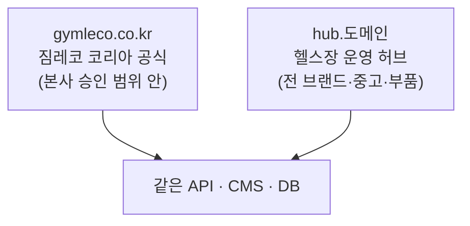

# 미결 사항 — 코드 쓰기 전에 확정할 것

기획서 v1.0 검토 중 발견한, **결정을 미루면 나중에 되돌리기 비싼** 항목들.
확정될 때마다 이 문서를 갱신한다.

---

## D-2. 관리자 화면을 어디에 둘 것인가 ✅ 확정

**결정: 공개 사이트와 완전히 분리하고, 관리자 SPA 를 API 와 같은 오리진에 둔다.**

```
방문자 ─▶ www.gymleco.co.kr          Vercel · Next.js (SSG/ISR)
              │  빌드·재검증 시 서버에서만 공개 API 를 읽는다
              │  문의 폼은 Next Route Handler 가 대신 전달한다
              ▼
대표님 ─▶ admin.gymleco.co.kr        EC2 · nginx
              ├─ /          관리자 SPA 정적 파일  (Vite + React)
              └─ /api/*     Spring Boot 프록시    ← SPA 와 동일 오리진
                                └─ PostgreSQL · S3
                     │ 발행 시
                     └─▶ POST www.gymleco.co.kr/api/revalidate
```

**이 구조를 고른 이유**

1. **CSP 충돌이 사라진다.** 공개 페이지는 SSG 를 지키기 위해
   `script-src 'unsafe-inline'` 이 필요하고, 관리자 화면은 강한 CSP 가 필요하다.
   한 앱에 두면 한 설정 파일에서 상반된 정책을 계속 갈라쳐야 한다.
2. **관리자 ↔ API 가 동일 오리진.** CORS 가 필요 없고, 인증 쿠키가
   host-only 로 발급되며 `SameSite=Strict` 가 온전히 작동한다.
3. **관리자 번들이 공개 사이트에 실리지 않는다.** 공개 도메인에 `/admin`
   경로 자체가 존재하지 않는다. 필요하면 nginx 에서 IP 제한을 추가할 수 있다.
4. **브라우저가 API 호스트를 직접 호출하지 않는다.** 문의 폼도 Next.js
   Route Handler 를 거치므로 API 노출면이 좁아진다.
5. **배포가 독립적이다.** 관리자 수정이 공개 사이트 재빌드를 유발하지 않는다.

**대가:** 배포 파이프라인 2개, nginx 설정 추가. 이 규모에서 감당 가능하다.

---

## D-1. 도메인 구조 🟠 (D-2 확정으로 난이도 하락)

**결정 필요 시점: 배포 설계 시**

D-2 에서 관리자와 API 를 같은 오리진에 두기로 하면서 **쿠키 도메인 문제는
해소됐다.** 인증 쿠키는 `admin.gymleco.co.kr` 에 host-only 로 발급되며
공개 사이트와 도메인을 공유할 필요가 없다.

남은 것은 이름 정하기다.

```
www.gymleco.co.kr      공개 사이트 (Vercel)
admin.gymleco.co.kr    관리자 + API (EC2)
cdn.gymleco.co.kr      CloudFront 이미지
```

→ 대표님께 도메인 보유 여부 확인 (기획서 §18-9)

**상태:** 도메인 확보 대기

---

## D-3. CMS 발행 → 정적 페이지 갱신 경로 🔴

**결정 필요 시점: Phase 2 API 설계 시**

SSG/ISR + 외부 CMS 조합의 함정. 대표님이 제품을 등록해도 Vercel 의 정적
페이지는 그대로다. 이게 없으면 "개발자 없이 운영 가능"이라는 요구사항
(기획서 §4.1)이 다른 이유로 무너진다.

구현: Spring Boot 가 저장 트랜잭션 **커밋 후**
`POST {REVALIDATE_URL}` (Bearer `REVALIDATE_TOKEN`) →
Next.js `/api/revalidate` 에서 `revalidatePath()` 호출.

같이 정해야 할 것:
- 재검증 실패 시 재시도 정책 (실패하면 사이트가 조용히 옛날 데이터를 보여준다)
- 어떤 경로를 무효화할지 (`/`, `/products`, `/products/[slug]`, `/news`)

**상태:** 미확정 — `.env.example` 에 자리만 잡아둠

---

## D-4. 문의 ↔ 제품 관계 🟡

**결정 필요 시점: 데이터 모델 확정 시**

기획서 §6 의 `inquiry.product_ids` 는 단일 컬럼에 ID 목록을 담는 구조다.
§1.2 의 2차 KPI("제품 상세 열람 → 문의 전환율")를 집계하려면 결국
조인이 필요하다.

→ `inquiry_product(inquiry_id, product_id)` 조인 테이블로 분리 권장.

**상태:** 미확정

---

## D-5. 문의자 개인정보 검색 방식 🟠

**결정 필요 시점: Phase 2 문의 관리 화면 구현 시**

전화번호를 랜덤 IV 로 암호화하면 관리자 화면에서 번호 검색이 불가능하다.

- 검색이 필요하다 → 정규화된 번호의 HMAC 을 **블라인드 인덱스 컬럼**으로 추가
- 검색이 불필요하다 → 암호화만. 더 안전하고 더 단순하다

**대표님이 실제로 전화번호로 검색할 일이 있는지 먼저 물어본다.**
없으면 만들지 않는 게 맞다.

부수 결정: CSV 내보내기는 전체를 평문으로 뽑아내므로 컬럼 암호화를
무력화한다. 감사 로그 기록 / 마스킹 옵션 / 권한 제한 중 최소 하나는 필요.

**상태:** 미확정

---

## D-6. 스크롤 연출 방식 🟠

**결정 필요 시점: Phase 0 자산 점검 직후**

기획서 §3.2 의 권장안은 "B 기본 + 대표 기구 1~2종만 A". 다만 이건
**제품 사진 자산이 어떤 상태인지 확인된 뒤에야** 확정할 수 있다.
누끼 없는 현장 사진뿐이면 B 조차 성립하지 않는다.

**상태:** §18-1 답변 대기

---

## D-7. 일정 버퍼 🟡

기획서 §15 의 8주에 버퍼가 없다. Phase 0 을 병목으로 정확히 짚어두고도
그 지연을 흡수할 여유가 없다. 촬영이 필요해지면 1~2주가 그대로 밀린다.

→ 대표님께 오픈일을 약속할 때는 **10주**로 말씀드리는 것을 권장.

**상태:** 미확정

---

## D-8. 공개 사이트의 CSP 강도 🟠

**결정 필요 시점: Phase 4 배포 전**

Next.js 16 번들 문서(`content-security-policy.md`)가 명시하는 제약:

> nonce 를 쓰면 **모든 페이지가 동적 렌더링으로 강제**되고
> "Static optimization and Incremental Static Regeneration (ISR) are disabled",
> CDN 캐싱 불가, PPR 비호환.

이 사이트는 SEO 때문에 SSG/ISR 이 전제다(기획서 §5). 따라서 공개 페이지에
nonce CSP 를 걸 수 없다.

**현재 적용:** `next.config.ts` 에서 `script-src 'self' 'unsafe-inline'`,
나머지 지시자는 조임. `CSP_ENFORCE=false` 로 Report-Only 상태.

**검토할 대안:** `experimental.sri` (해시 기반 Subresource Integrity).
정적 생성을 유지하면서 `'unsafe-inline'` 을 뺄 수 있다고 문서화돼 있다.
단 **실험 기능**이므로 상용 사이트에 넣기 전 실측이 필요하다.

판단 기준: 관리자 화면이 분리(D-2)되면서 공개 사이트에는 민감한 입력이
문의 폼 하나뿐이다. 저장형 XSS 의 1차 방어선은 **서버측 HTML 살균**이고
CSP 는 2차 방어선이다. SRI 가 불안정하면 현재 설정으로 가도 된다.

**상태:** Report-Only 로 관찰 중

---

## D-10. 공개 사이트 호스팅 — Vercel vs 자체 운영 🟠

**결정 필요 시점: Phase 4 배포 전 (프론트 코드에는 영향 없음)**

**주의:** D-2 의 "분리"는 **오리진 분리**(도메인이 다름)이지 인프라 분리가
아니다. 같은 EC2 의 같은 nginx 뒤에 두 도메인을 올려도 D-2 의 이점
(CSP 분리, 번들 분리, CORS 없음)은 전부 유지된다.

### 안 A — Vercel + EC2 (기획서 원안)

- ISR·on-demand revalidation 이 설정 없이 동작
- 브랜치별 프리뷰 배포 → Phase 1 연출 승인(§15)에 유용
- 이미지 최적화 위임
- 대가: 벤더 2개, 청구서 2개

### 안 B — EC2 단일 + Cloudflare 앞단 (권장)

```
Cloudflare (DNS + CDN + WAF, 무료 티어)
   ├─ www.gymleco.co.kr   ─▶ nginx ─▶ Next.js (standalone, Docker)
   └─ admin.gymleco.co.kr ─▶ nginx ─┬─ 관리자 SPA
                                    └─ /api ─▶ Spring Boot
```

- **보안그룹 443 을 Cloudflare IP 대역으로만 개방** → 오리진 IP 은닉,
  DDoS·WAF 무료. 기획서 §8 원칙에 부합하며 원안에 없던 방어 겹이다.
- 벤더 1개. 인수인계 시 "서버 한 대"로 설명된다.
- EC2 는 Spring Boot 때문에 어차피 필요하다.

**대가:**
1. 프리뷰 배포 없음 → 스테이징 서브도메인을 따로 마련해야 한다
2. 빌드를 EC2 에서 하면 메모리가 부족하다 → CI 에서 빌드 후 이미지 배포
3. ISR 캐시가 인스턴스 로컬 → 단일 인스턴스면 무방, 스케일아웃 시 `cacheHandlers`
4. 배포 중 다운타임 → 롤링/blue-green 필요

### 안 C — Cloudflare 에 프론트 둘 다 (권장 후보)

> 초기 검토에서 "Next 16 은 어댑터가 일러서 비권장"이라고 적었으나 **틀렸다.**
> 실제 확인 결과:
> ```
> @opennextjs/cloudflare  1.20.2
> peerDependencies.next:  >=15.5.21 <16 || >=16.2.11
> ```
> 설치된 16.3.0 은 지원 범위 안이다.

**대전제: Cloudflare 는 Java 를 실행할 수 없다.** Spring Boot +
PostgreSQL 은 어디든 별도 서버가 필요하다. "전부 Cloudflare"는 불가능하고,
실제 선택지는 "프론트 둘 다 Cloudflare, API 만 밖"이다.

```
Cloudflare
  ├─ www.gymleco.co.kr    Workers (OpenNext) — Next.js, 증분 캐시 R2/KV
  ├─ admin.gymleco.co.kr  Pages — 관리자 SPA (정적)
  │     └─ /api/*         Worker 프록시 ──┐   ← 동일 오리진 유지
  └─ cdn.gymleco.co.kr    R2 (이미지)      │
                                          ▼
       EC2 ─ Spring Boot + PostgreSQL  (Cloudflare Tunnel)
```

**원안에 없던 방어 겹 2개가 생긴다**

1. **Cloudflare Access (Zero Trust)** — 50명까지 무료. `admin.` 앞에
   신원 게이트를 세우면 공격자가 로그인 화면에 도달조차 못 한다.
   §10 이 "최대 표적"이라 부른 문제에 대한 가장 값싼 답이며,
   앱에 2FA 를 구현하기 전에 이것부터 켜는 편이 효과가 크다.
2. **Cloudflare Tunnel** — EC2 가 아웃바운드로만 연결하므로 보안그룹
   인바운드를 전부 닫을 수 있다. SSH 를 SSM 으로 빼면 열린 포트가 0개다.
   §8 "가장 강력한 보안은 문을 없애는 것"의 문자 그대로의 실현.

Worker 프록시가 nginx 역할을 대신하므로 **동일 오리진·CORS 없음·
host-only 쿠키**는 그대로 유지된다 (D-2 의 이점 보존).

**대가**
1. OpenNext 라는 레이어가 하나 늘어난다. 문제 발생 시 디버깅 대상 증가
2. ISR 증분 캐시를 R2/KV 로 직접 구성해야 한다 (자동 아님)
3. Next 16.3 + 어댑터 1.20.2 조합은 **실측 필요**
4. `next/image` 최적화에 커스텀 로더 필요
   → Spring Boot 가 업로드 시 재인코딩(§11)하므로 R2 에 WebP/AVIF 를
     미리 생성해 두면 해결된다

**더 단순한 변형:** 공개 사이트를 `output: "export"` 정적 내보내기로 두면
어댑터가 아예 필요 없다. Cloudflare Pages 가 정적 파일만 서빙하고,
CMS 발행 시 Deploy Hook 으로 재빌드(1~2분)한다. 제품 수십 개 규모면
ISR 이 굳이 필요 없다. 대신 Route Handler 를 못 쓰므로 문의 폼 프록시는
Pages Function 으로 만든다.

### 확정 시 바뀌는 것

- `next.config.ts` 에 `output: "standalone"` 추가
- nginx 설정 (헤더 중복 방지 — 앱이 보안 헤더를 내보내고 nginx 는 TLS·프록시만)
- CLAUDE.md 보안규칙 6번, SECURITY-CHECKLIST 2절의 "Vercel 이 서빙" 전제

**선행 확인:** 호스팅 비용 부담 주체 (§18-9)

**상태:** 안 B 권장, 미확정

---

## D-17. 장기 방향 — 헬스장 운영 허브 🔴 미결 (오픈 전 결정 필요)

**배경**

대표님은 짐레코 외에도 여러 기구 브랜드와 중고 기계를 함께 다루신다.
사업 실체에 맞추면 "짐레코 코리아 사이트"보다 **헬스장 대표님들이 쓰는
운영 허브**가 최종 형태에 가깝다.

**아직 클라이언트와 확정되지 않았다.** 1차는 짐레코 코리아 사이트로
진행하되, 그 방향으로 갈 수 있게 문을 열어 둔다.

### 먼저 구분할 것

| | 내용 | 난이도 |
|---|---|---|
| **판매자 1인 · 브랜드 다수** | 대표님이 여러 브랜드를 취급 | 데이터 모델 한 겹 |
| 판매자 다수 (마켓플레이스) | 정산·권한·분쟁 처리 | 완전히 다른 프로젝트 |

현재 구상은 **전자**다. 이 구분을 놓치면 필요 없는 복잡도를 떠안는다.

### 지금 해두면 싼 것

- **`product.brand` · `used_item.brand`** — 컬럼 하나 + 마이그레이션 하나.
  나중에 넣으면 전 행 백필 + 모든 쿼리·화면 수정이다.
  허브로 가지 않아도 손해가 컬럼 하나뿐이라 비대칭적으로 유리하다.
- **슬러그 규칙** — 브랜드가 늘면 `power-rack` 이 겹친다.
  `gymleco-power-rack` 처럼 브랜드를 접두사로 두면 스키마 변경 없이 해결된다.
- `used_item.product_id` 는 이미 nullable — 타 브랜드 중고를 받을 수 있다
- `inquiry` 는 원래 브랜드 중립이다

### 지금 하면 안 되는 것

멀티테넌시 · 브랜드별 마이크로사이트 · 정산/결제.
확정되지 않은 방향에 구조를 맞추면 1차 오픈이 밀린다.

### 🔴 오픈 전에 반드시 결정해야 하는 것

**도메인과 브랜드 정체성.** 기술이 아니라 사업 결정이며,
**오픈 후에는 되돌리는 비용이 훨씬 커진다.**

1. `gymleco.co.kr` 로 SEO 를 쌓은 뒤 허브로 전환하면 검색 자산이
   브랜드명에 묶여 그대로 옮겨지지 않는다
2. **스웨덴 본사 승인** — "짐레코 코리아 공식 사이트"에 경쟁 브랜드
   제품이 실리는 것을 본사가 허용할지 알 수 없다.
   기획서 §16 이 브랜드 사용 권한을 리스크로 잡아뒀는데,
   허브 방향은 그 리스크를 정면으로 건드린다

### 권고 — 사이트를 나누고 백엔드를 공유



현재 구조가 이미 이 방향이다 — `FE` 안에 `web`·`admin` 이 있고
여기에 앱이 하나 더 붙는 형태다. 대표님은 관리 화면 **하나로** 양쪽을
운영하고, 본사 승인 문제도 피한다.

**결정 필요**
- [ ] `brand` 컬럼을 지금 넣을 것인가
- [ ] 대표님과 방향 합의 (1차 오픈 전)
- [ ] 도메인 전략 — 단일 vs 분리
- [ ] 허브가 짐레코 코리아 비용으로 만들어지는 부분의 소유·라이선스

**상태:** 미결. 클라이언트 확인 대기

---

## D-13. 저장소 분리 ✅ 확정

**결정: `FE`(web + admin) 와 `BE` 두 개. 조직 `.github` 가 공용 문서·템플릿.**

4개로 쪼개지 않은 이유는 개발자가 한 명이기 때문이다. API 계약이 바뀌면
여러 저장소를 동시에 고쳐야 하고, 그때마다 PR 개수와 버전 스큐가 늘어난다.

**주의: 상속되는 것과 안 되는 것**

조직 `.github` 저장소는 PR·이슈 템플릿과 `SECURITY.md` 를 모든 저장소에
자동 제공한다. 그러나 **워크플로·dependabot·gitleaks 설정은 상속되지 않아**
`FE` 와 `BE` 양쪽에 복제돼 있다.

→ **보안 설정을 바꿀 때는 반드시 양쪽을 함께 수정한다.** 복제된 설정은
반드시 어긋나며, 한쪽만 고치고 잊는 것이 전형적인 경로다.

나중에 쪼개는 것은 `git subtree split` 으로 이력을 보존한 채 가능하다.
합치는 것은 어렵다. 그래서 지금은 적게 나눠 둔다.

---

## D-14. 백엔드 내부 분리 수준 ✅ 확정

**결정: 단일 모듈 + 3겹 분리. 서버를 나누지 않는다.**

| 겹 | 수단 |
|---|---|
| URL 접두사 | `/api/admin/**` vs `/api/public/**` — 엣지에서도 강제 가능 |
| 필터 체인 | `SecurityFilterChain` 2개 + 나머지를 `denyAll` 하는 3번째 |
| 패키지 | `kr.co.gymleco.{admin,publicapi,domain,infra}` |

**필터 체인 분리가 패키지 분리보다 강하다.** 컨트롤러에 `@PreAuthorize` 를
깜빡해도 체인이 막는다. 기획서 §11 이 "하나만 빠지면 그게 구멍"이라 한
문제의 구조적 해법이다.

**서버를 나누지 않은 이유**
- t3.small 2GB 에 PostgreSQL 도 함께 있다. JVM 두 개는 빠듯하다
- 두 앱이 같은 DB 를 쓰면 Flyway 실행 주체를 정해야 하고 기동 시 잠금 경합이 난다
- 지켜야 할 자산(`inquiry`)이 어차피 한 곳이라 격리 효과가 제한적이다
- **클라이언트가 내는 서버비가 두 배가 된다**

---

## D-15. 품목 확장 방식 ✅ 확정

**결정: 기구·부품·악세사리는 `product.type` 으로, 중고는 별도 테이블.**

셋은 이름·이미지·설명·정렬·공개여부가 동일하고 다른 것은 "치수가 의미
있는가" 뿐이다. 테이블을 나누면 관리 화면과 이미지 파이프라인을 세 벌
만들게 된다.

대신 **조건부 CHECK** 로 기구에만 설치 면적을 강제한다.

```sql
CHECK (CASE WHEN type = 'EQUIPMENT'
            THEN footprint_m2 IS NOT NULL AND footprint_m2 > 0 ...
            ELSE ... END)
```

**중고는 다르다.** 카탈로그가 아니라 개별 물건이다. 같은 파워 랙이라도
2019년식과 2022년식은 다른 매물이고, 하나가 팔려도 다른 하나는 남는다.
`product` 로는 표현되지 않으므로 `used_item` 을 따로 뒀다.

---

## D-16. 배치 중복 실행 🟡 미결

**결정 필요 시점: 인스턴스를 2대 이상으로 늘릴 때**

개인정보 자동 파기(`InquiryPurgeScheduler`)와 만료 토큰 정리는
`@Scheduled` 로 돈다. **인스턴스를 늘리면 모든 인스턴스에서 동시에 실행된다.**

지금은 서버 한 대 전제라 문제없다. 스케일아웃 시점에 필요한 것:
- ShedLock (DB 기반 분산 락) 또는
- 리더 선출 또는
- 배치를 별도 프로세스로 분리

파기 배치는 중복 실행돼도 결과가 같지만(이미 지운 행을 다시 지울 뿐),
나중에 "파기 전 통계 집계" 같은 부수효과가 붙으면 문제가 된다.

**상태:** 단일 인스턴스 전제로 진행 중

---

## D-11. Rust 도입 범위 ✅ 확정

**결정: 이미지 재인코딩·리사이즈 워커에만 도입한다. 메인 API 는 Spring Boot.**

Rust 로 서버 전체를 쓰는 것도 기술적으로는 가능하다 (`ammonia` 는 오히려
Java 쪽 살균 라이브러리보다 낫다). 문제는 라이브러리가 아니라 **인증·암호화
스택을 언어를 배우면서 직접 조립해야 한다**는 점이다.

이 사이트는 이름·전화·이메일을 저장하고, 외부의 불법적 접근에 의한 유출이면
건수와 무관하게 72시간 내 신고 의무가 붙는다. Spring Security 는 검증된
인증 모델을 통째로 제공하는 반면, Rust 에서는 조각을 모아 직접 맞춰야 한다.
기획서 §5 도 *"클라이언트 프로젝트엔 익숙한 스택이 안전"* 이라고 적고 있다.

**이미지 워커가 첫 Rust 서비스로 적합한 이유**

- 계약이 단순하다: S3 in → 재인코딩 → S3 out
- 인증 없음, 개인정보 없음
- 실패해도 폴백 가능 (앱에서 동기 처리로 대체)
- 성능 이득이 실제로 있는 영역

**상태:** 확정. 위치는 `worker/` (Phase 2 후반)

---

## D-12. 쿠버네티스 ✅ 확정

**결정: 매니페스트는 저장소 산출물로 작성하되, 운영은 Docker Compose.**

방문자 하루 수백 명 규모의 사이트 하나에 k8s 는 과하다.

- EKS 컨트롤 플레인만 월 $73, 노드 별도 — 클라이언트가 내는 돈이다
- 단일 노드 k3s 로 낮추면 복잡도만 남고 이점은 사라진다
- **인수인계**: "서버 한 대 + Compose" 와 "k8s 클러스터"는 다음 개발자에게
  전혀 다른 난이도다. 기획서 §16 이 유지보수 부담을 리스크로 잡은 이유다

포트폴리오 가치는 매니페스트와 설계 문서로 확보한다. 면접에서 보여줄 것은
매니페스트이지 클라이언트 청구서가 아니다.

**상태:** 확정. `k8s/` 에 Deployment·Service·Ingress·HPA·Secret 예시 작성 예정

---

## D-9. 한글 폰트 ✅ 확정 (재검토 여지 있음)

**결정: 한글은 시스템 폰트 스택, 라틴 디스플레이만 웹폰트(Archivo).**

`next/font/google` 의 폰트 메타데이터를 직접 확인한 결과:

```
Noto Sans KR  => subsets: ["cyrillic","latin","latin-ext","vietnamese"]
```

**`korean` 서브셋이 없다.** next/font 는 선언한 subsets 만 내려받으므로
한글 글리프가 포함되지 않고, 결국 시스템 폰트로 폴백된다.
즉 웹폰트를 건 것처럼 보이지만 실제로는 아무 효과가 없다.

한글 웹폰트를 쓰려면 `next/font/local` 로 직접 호스팅해야 한다
(Pretendard 등). 다만 첫 화면 2.5초 제약(기획서 §3.4-3)을 고려하면
시스템 스택이 유리하다 — 다운로드 0, CLS 0.

**재검토 시점:** 본사 브랜드 가이드(§18-3)에 지정 폰트가 있는 경우.
그때는 `globals.css` 의 `--font-sans` 만 교체하면 된다.
