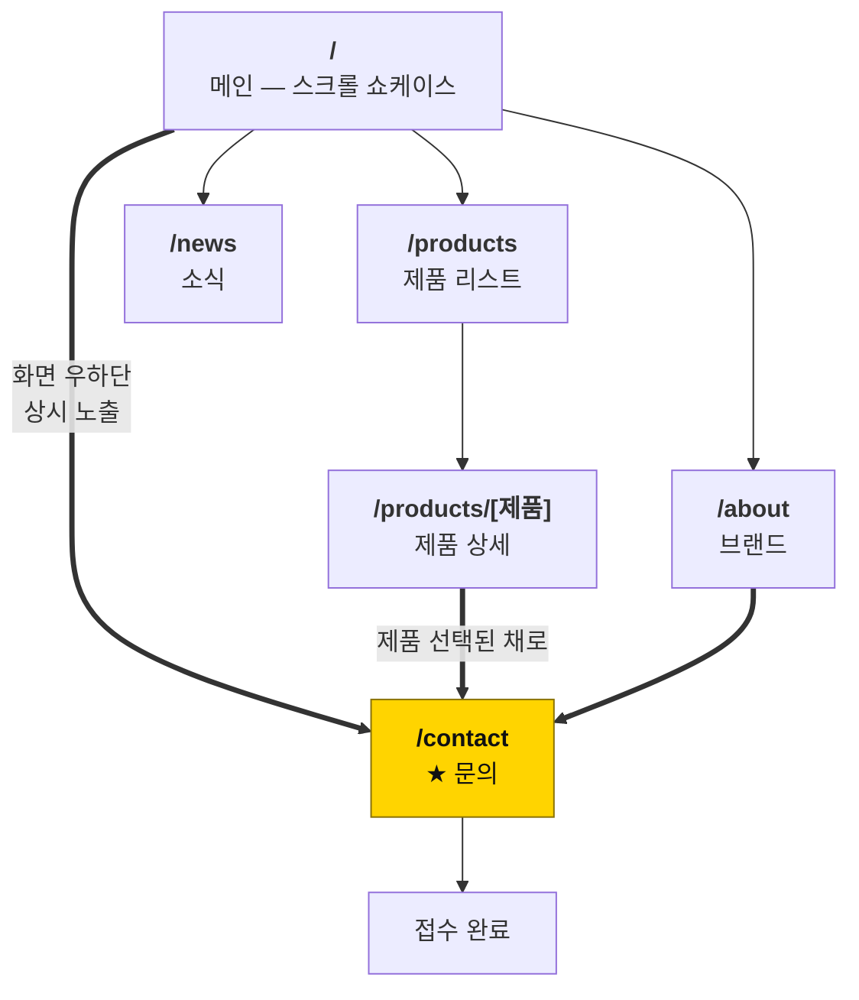
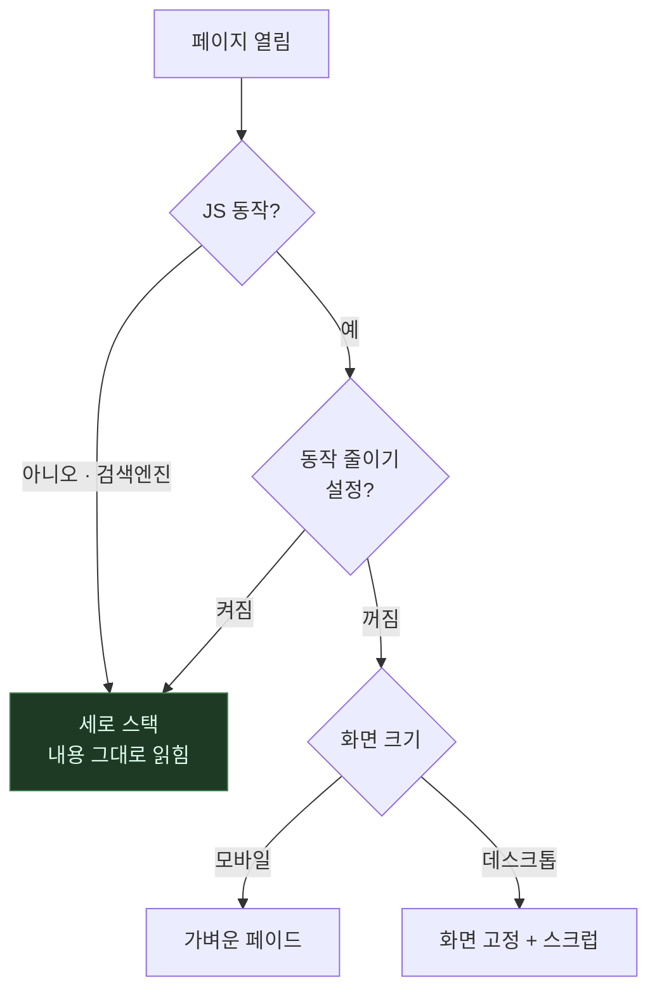
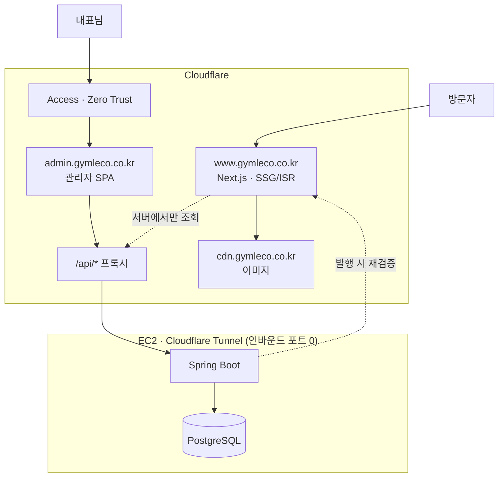
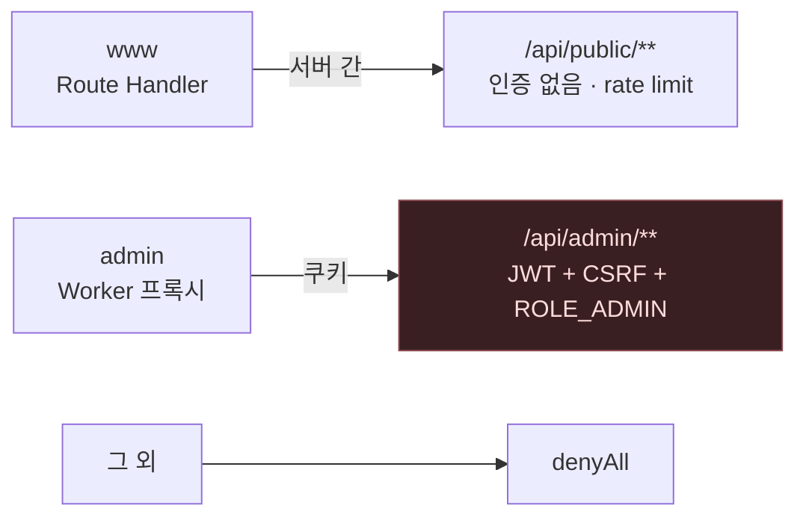
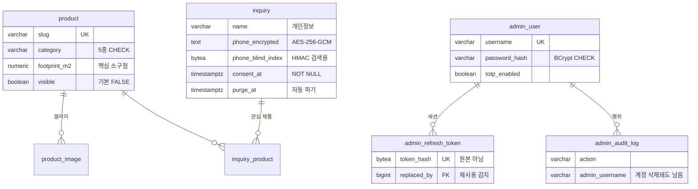
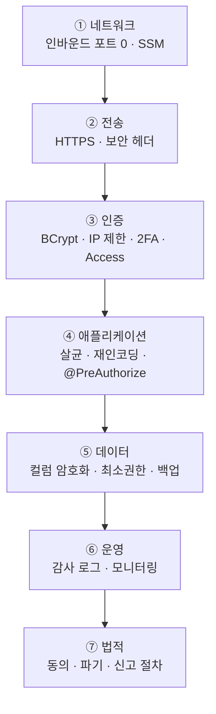

# GYMLECO KOREA

> 스웨덴 헬스기구 브랜드 짐레코 한국 총판 공식 웹사이트

이커머스가 아니라 **B2B 리드 제너레이션 사이트**입니다.
장바구니가 아니라 **문의**가 목표 행동이고, 모든 화면의 종착지는 문의 폼입니다.

---

# 화면 설계

## 사이트 구조



**모든 경로가 문의로 수렴합니다.** 문의가 아닌 종착지는 없습니다.

## 메인 — 스크롤 구조

화면의 80%를 차지하는 핵심 구간입니다.
왼쪽 숫자는 스크롤 진행률이고, **20~70% 구간에서 화면이 고정된 채 제품이 한 대씩 교체**됩니다.

```
  0%   ┌──────────────────────────────┐   ┌─────────┐
       │ GYMLECO          제품 브랜드 │   │ 견적·   │
       │                              │   │ 무료시연│
       │ BORN IN SWEDEN               │   │ 문의    │
       │ 스웨덴에서 온,               │   └─────────┘
       │ 공간을 아는 기구             │    ↑ 우하단 고정
       │                              │      스크롤 내내
       │ [무료 시연 신청] [라인업 →]  │      사라지지 않음
       └──────────────────────────────┘
 10%   ┌──────────────────────────────┐
       │ “좋은 기구는 조용합니다.”    │
       │  브랜드 스테이트먼트         │
       └──────────────────────────────┘
 20%   ┌──────────────────────────────┐  ★ 화면 고정
   ~   │                    01 / 06   │
 70%   │  ┌────────┐  RACK            │
       │  │ 설치   │  파워 랙         │
       │  │ 면적   │  POWER RACK      │
       │  │ 다이어 │                  │
       │  │ 그램   │  설치면적 2.6 m² │
       │  │ ▨ 2.6  │  1400×1850×2300  │
       │  │ ░ 4.2  │  210 kg          │
       │  └────────┘  [자세히 보기 →] │
       │   −38%                       │
       │  스크롤 = 타임라인 (역재생)  │
       └──────────────────────────────┘
 70%   ┌ 왜 짐레코인가 (본사직영·공간효율·오피셜센터) ┐
 80%   ┌ 소식 3건 ────────────────────┐
 90%   ┌──────────────────────────────┐
       │ “공간을 알려주시면           │
       │  배치안을 함께 그려 드립니다”│
       │ [견적 문의] [무료 시연 신청] │
       └──────────────────────────────┘
100%   ┌ 푸터 · 사업자정보 · 처리방침 ─┐
```

## 연출이 꺼지는 경우



어느 경로로 빠지든 **최악의 결과가 "애니메이션 없는 목록"이지 "빈 화면"이 아니어야** 합니다.
이 사이트의 1순위 제약입니다.

## 문의 폼 — 가장 중요한 화면

```
┌───────────────────────────────────────────┐
│ 문의 유형   (●견적) (○무료시연) (○오피셜) │
│                                           │
│ 이름 *      [___________________]         │
│ 연락처 *    [___________________]         │
│ 이메일      [___________________]         │
│ 업체명      [___________________]         │
│ 평수·천장고 [___________________]         │
│ 관심 제품   ☑파워랙 ☐케이블 ☐스미스…      │
│ 내용        [                   ]         │
│                                           │
│ ┌───── 개인정보 수집·이용 동의 ─────────┐ │
│ │ ☐ (필수) 수집·이용에 동의합니다      │ │
│ │    이름·연락처·이메일·업체명 /        │ │
│ │    문의 응대 / 처리 후 1년 보관       │ │
│ │ ☐ (선택) 마케팅 정보 수신 동의       │ │
│ └───────────────────────────────────────┘ │
│                                           │
│ [ 문의 보내기 ]                           │
│ (숨김) honeypot — 봇만 채운다             │
└───────────────────────────────────────────┘
```

- 필수는 **이름·연락처·동의** 셋뿐. 필수가 늘수록 문의가 줄고, 법적으로도 최소 수집이 원칙입니다
- 동의는 **기본 해제**. 미리 체크해 두면 동의로 인정되지 않습니다
- **마케팅 동의는 별도 항목.** 필수 동의에 묶으면 위법입니다
- 전송이 실패하면 **전화번호를 함께 안내**합니다. 폼이 죽었다고 문의를 놓칠 수는 없습니다

## 관리자 — 문의 접수함

```
┌──────────────────────────────────────────┐   ┌────────────────────────┐
│ 상태[전체▼] 검색[____] [CSV 내보내기]    │   │ 문의 상세              │
├────┬──────┬────────┬──────────┬──────────┤   │ 이름   홍길동          │
│상태│ 이름 │ 유형   │ 업체     │ 접수일   │   │ 연락처 010-1234-5678   │
├────┼──────┼────────┼──────────┼──────────┤   │ 업체명 ○○피트니스     │
│신규│ 김** │무료시연│○○피트니스│ 08-10    │   │ 상태  [연락중 ▾]      │
│연락│ 이** │ 견적   │△△짐     │ 08-09    │   │ 메모  [____________]  │
│완료│ 박** │ 견적   │□□스튜디오│ 08-07    │   │ 파기예정 2027-08-10    │
└────┴──────┴────────┴──────────┴──────────┘   └────────────────────────┘
      ↑ 이름 마스킹 · 연락처 미표시                ↑ 열람 시 감사 로그 기록
```

목록에서 이름을 가리는 이유는 **화면을 켜 둔 것만으로 고객 정보가 노출되지 않게** 하기 위해서입니다.
사무실 모니터는 생각보다 많이 보입니다.

> 📐 전체 도면 9장 (제품 리스트·상세, 접수 완료, 대시보드, 제품 등록 포함)은
> [`docs/wireframes.html`](https://github.com/gymleco/.github/blob/main/docs/wireframes.html) 에 있습니다.
> 브라우저로 열면 주석과 함께 볼 수 있습니다.
> 상세 사양은 [`docs/04-screens.md`](https://github.com/gymleco/.github/blob/main/docs/04-screens.md).

<br>

---

<br>

# 개발자용 설계

## 스택

| 영역 | 선택 | 이유 |
|---|---|---|
| 공개 프론트 | Next.js 16 · TypeScript · Tailwind v4 | B2B 는 검색 유입이 중요 → SSG/ISR |
| 애니메이션 | GSAP ScrollTrigger + Lenis | 스크롤 스크럽·핀 고정의 표준 조합 |
| 관리자 | Vite · React · TypeScript | API 와 동일 오리진 정적 SPA |
| API | Spring Boot 4.1 · Java 21 | 3.5.x 는 OSS 지원 종료 가능성 |
| DB | PostgreSQL 17 · Flyway | 스키마 소유자는 Flyway |
| 인증 | Spring Security 7 · OAuth2 Resource Server | JWT 검증을 Nimbus 로 표준 처리 |
| 이미지 | 오브젝트 스토리지 + CDN | 앱 서버가 파일을 서빙하지 않음 |

## 저장소

| 저장소 | 내용 |
|---|---|
| **FE** | `web/` 공개 사이트 · `admin/` 관리자 CMS |
| **BE** | API · 인증 · 이미지 파이프라인 · 마이그레이션 |
| **.github** | 이 저장소 — 설계 문서, PR·이슈 템플릿(조직 전체 상속) |

## 배포 구조



**오리진은 둘, 서버는 하나입니다.** 도메인을 나눠 CSP·번들·쿠키를 분리하되
인프라는 하나로 둡니다 — 인수인계 시 "서버 한 대"로 설명됩니다.

관리자 SPA 와 API 가 **동일 오리진**이라 CORS 가 없고 인증 쿠키가 host-only 입니다.
Cloudflare Tunnel 로 EC2 는 아웃바운드 연결만 맺으므로 **보안그룹 인바운드를 전부 닫을 수 있습니다.**

## API 경계



경로가 곧 보안 경계입니다. 엣지와 애플리케이션 **두 겹**으로 가르고,
나머지 전부를 `denyAll` 하는 체인을 마지막에 둡니다 —
**새 엔드포인트 등록을 잊으면 열리는 게 아니라 막힙니다.**

## 데이터 모델



**개인정보는 `inquiry` 한 테이블에만 둡니다.** 분산되면 파기·접근제어·감사를
모든 곳에 적용해야 하고, 반드시 하나를 빠뜨립니다.

전화번호는 랜덤 IV 로 암호화하므로 검색이 불가능합니다. 그래서 정규화한 번호의
HMAC 을 별도 컬럼에 둡니다 — 결정적 암호화를 쓰면 복호화 없이 빈도 분석이 가능해집니다.

## 코드로 강제하는 것들

DB 제약으로 막습니다. 코드에 실수가 있어도 잘못된 데이터가 들어가지 않습니다.

| 제약 | 막는 것 |
|---|---|
| `password_hash ~ '^\$2[aby]\$'` | MD5·SHA·평문 비밀번호 저장 |
| `consent_at NOT NULL` | 동의 없는 개인정보 저장 |
| `purge_at > consent_at` | 파기일 계산 실수 |
| `NOT visible OR published_at IS NOT NULL` | 발행일 없는 소식 공개 |
| `visible DEFAULT FALSE` | 작성 중인 제품의 실수 공개 |

실제 PostgreSQL 17 에 적용해 **16개 항목이 모두 거부되는 것을 확인**했습니다.
CI 가 PR 마다 같은 검증을 반복합니다.

## 트랜잭션 방침

| 항목 | 규칙 | 이유 |
|---|---|---|
| `open-in-view` | **false** | true 면 뷰 렌더링까지 커넥션을 붙들어 풀이 요청 수만큼 묶인다 |
| 조회 | `@Transactional(readOnly = true)` | 플러시 생략, 더티체킹 스냅샷 미생성 |
| 배치 | `batch_size: 50` + `order_inserts` | 갤러리 다건 저장 시 왕복 감소 |
| 외부 호출 | `@TransactionalEventListener(AFTER_COMMIT)` | 커밋 전에 부르면 롤백된 데이터로 사이트가 갱신된다 |
| 페이징+컬렉션 | `fail_on_pagination_over_collection_fetch` | 메모리 페이징을 예외로 드러낸다 |

## 보안 설계



보안은 뚫리지 않는 벽이 아니라 **여러 겹의 문**입니다.
하나가 뚫려도 다음에서 막히고, 그 사이에 알아챌 수 있어야 합니다.

**실패는 안전한 방향으로 기울입니다.**

- 시크릿 스캐너가 없으면 → 커밋을 막는다 (통과시키지 않는다)
- 필터 체인 등록을 잊으면 → 차단된다 (열리지 않는다)
- 연출이 깨지면 → 정적 목록으로 남는다 (빈 화면이 되지 않는다)
- 새 제품을 만들면 → 비공개로 시작한다 (실수로 공개되지 않는다)

## 문서

| 문서 | 언제 보는가 |
|---|---|
| [작업 계획](https://github.com/gymleco/.github/blob/main/docs/01-project-plan.md) | 일정·산출물·리스크 |
| [인프라 구조](https://github.com/gymleco/.github/blob/main/docs/02-infrastructure.md) | 배포 구성·요청 경로·비용 |
| [DB 구조](https://github.com/gymleco/.github/blob/main/docs/03-database.md) | ERD·테이블 명세·개인정보 처리 |
| [화면 설계](https://github.com/gymleco/.github/blob/main/docs/04-screens.md) | 화면을 만들기 전에 |
| [API 명세](https://github.com/gymleco/.github/blob/main/docs/05-api-spec.md) | 엔드포인트·인증 흐름 |
| [미결 사항](https://github.com/gymleco/.github/blob/main/docs/OPEN-DECISIONS.md) | 구조를 정하기 전에 |
| [보안 체크리스트](https://github.com/gymleco/.github/blob/main/docs/SECURITY-CHECKLIST.md) | 배포 전·보안 코드 수정 시 |
| [클라이언트 확인 항목](https://github.com/gymleco/.github/blob/main/docs/PHASE0-CLIENT-QUESTIONS.md) | 대표님께 그대로 전달 가능 |
